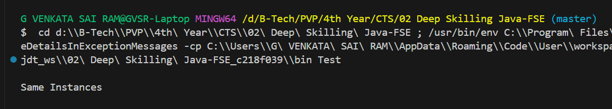

# 🔒 Singleton Design Pattern – Logger Example

This demonstrates a basic implementation of the **Singleton Design Pattern** in Java using a `Logger` class. The Singleton pattern ensures that a class has only one instance and provides a global point of access to it.

## 📄 Code Overview

- `Logger.java`: Defines the singleton class.
- `Test.java`: Tests the singleton behavior by verifying if two instances are actually the same.

```java
Logger lgp = Logger.getInstance();
Logger lgp1 = Logger.getInstance();
System.out.println(lgp == lgp1 ? "Same Instances" : "Different Instances");
````

## 🖥 Output

Below is the sample terminal output after running the test class:



## 💡 Key Concepts

* **Private constructor** restricts instantiation from other classes.
* **Static method** `getInstance()` returns the same object every time.
* **Lazy Initialization**: The object is created only when needed.

## 📂 Project Structure

````
.
├── Logger.java
├── Test.java
├── assets/
│   └── Output.png
└── README.md
````

## ✅ Result

The test confirms that both references (`lgp` and `lgp1`) point to the same instance:

````
Same Instances
````

## 🚀 How to Run

Compile and run the code:

````bash
javac Logger.java Test.java
java Test
````

Make sure `Logger` and `Test` are in the same directory or adjust package/imports accordingly.

## 📚 Learn More

* [GeeksForGeeks - Singleton Pattern](https://www.geeksforgeeks.org/singleton-design-pattern/)
* [Baeldung - Singleton in Java](https://www.baeldung.com/solid-principles)

#### Happy Coding 🎯