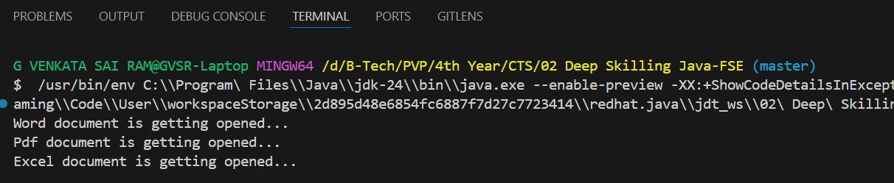

# 🏗️ Exercise 2: Implementing the Factory Method Pattern

### 📘 Scenario:
You are developing a **document management system** that needs to create different types of documents (e.g., Word, PDF, Excel). Use the **Factory Method Pattern** to achieve this.

### 🛠️ Steps:
1. **Create a New Java Project**  
   - Project Name: `FactoryMethodPatternExample`

2. **Define Document Classes**  
   - Create interfaces or abstract classes for different document types such as `WordDocument`, `PdfDocument`, and `ExcelDocument`.

3. **Create Concrete Document Classes**  
   - Implement concrete classes for each document type that implement or extend the above interfaces or abstract classes.

4. **Implement the Factory Method**  
   - Create an abstract class `DocumentFactory` with a method `createDocument()`.  
   - Create concrete factory classes for each document type that extend `DocumentFactory` and implement the `createDocument()` method.

5. **Test the Factory Method Implementation**  
   - Create a test class to demonstrate the creation of different document types using the factory method.

# 🧩 Factory Method Design Pattern – Document Opener

This repository contains an implementation of the **Factory Method Design Pattern** in Java. It demonstrates how to create different types of documents (Word, PDF, Excel) using dedicated factory classes without exposing the instantiation logic.

## 📂 Project Structure

````

.
├── Document.java
├── WordDocument.java
├── PdfDocument.java
├── ExcelDocument.java
├── DocumentFactory.java
├── WordDocumentFactory.java
├── PdfDocumentFactory.java
├── ExcelDocumentFactory.java
├── FactoryMethodTest.java
├── Output.png
└── README.md

````

## 🔧 Implementation Summary

- `Document`: Interface for all document types.
- `WordDocument`, `PdfDocument`, `ExcelDocument`: Implement the `Document` interface.
- `DocumentFactory`: Abstract base factory class.
- `WordDocumentFactory`, `PdfDocumentFactory`, `ExcelDocumentFactory`: Concrete factory classes that implement `createDocument()`.
- `FactoryMethodTest`: Client code to demonstrate dynamic creation and usage of document instances.

## 🖥 Output

The output confirms each document type is being correctly opened:

