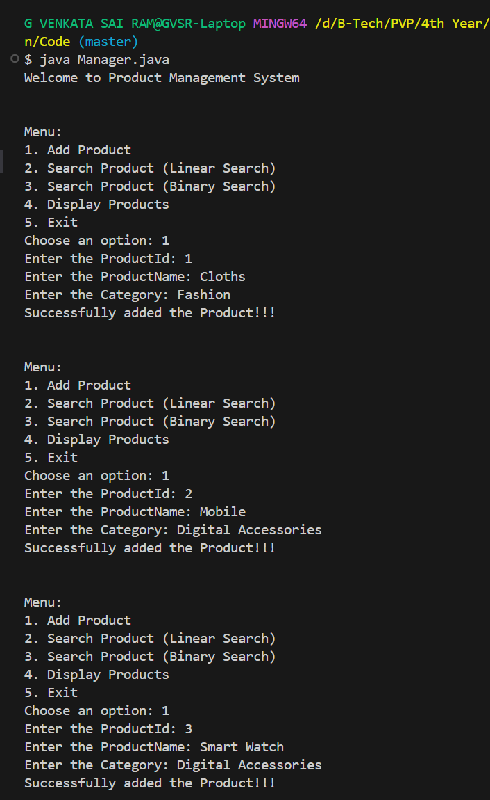
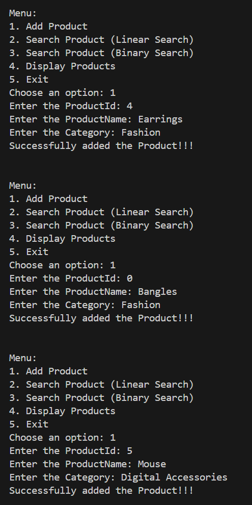
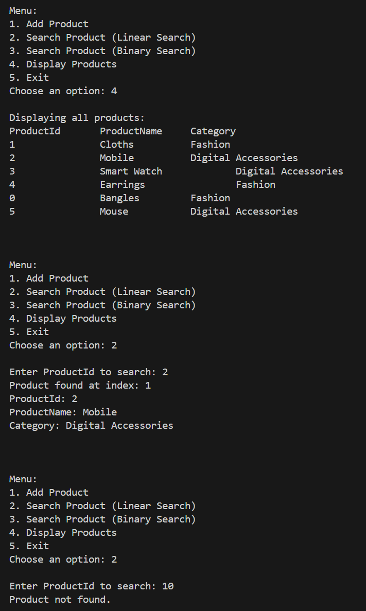
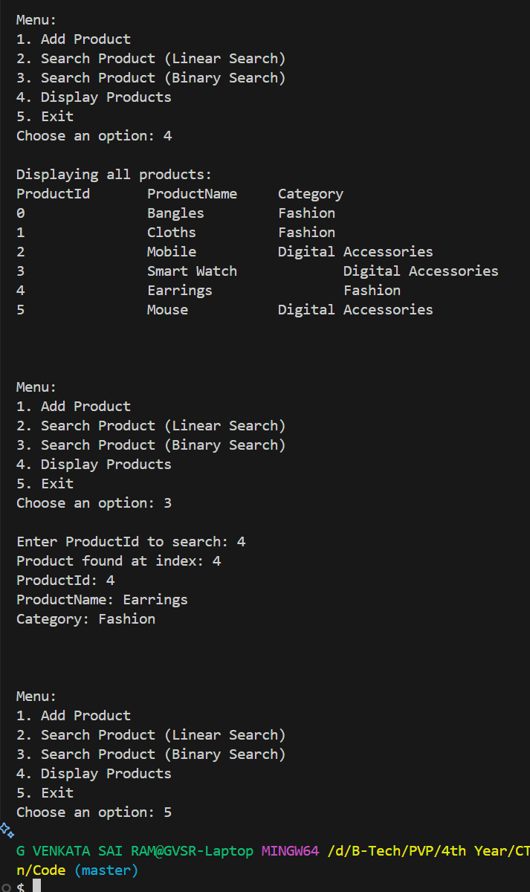

# 🛒 Exercise 2: E-commerce Platform Search Function

### 📘 Scenario:
You are working on the search functionality of an e-commerce platform. The search needs to be optimized for fast performance.

### ✅ Steps & Solutions:

#### 1. Understand Asymptotic Notation:

- **Big O Notation**:  
  Big O notation is an upper bound for an algorithm and is used to measure the time and space complexity.  
  It represents the worst-case complexity.  
  `f(n) <= c * g(n)`

- **Best, Average, and Worst Cases for Search**:

  **Linear Search**:
  - Best: Element is at the beginning  
  - Average: Element is in the middle  
  - Worst: Element is at the end

  **Binary Search**:
  - Best: Element is in the exact middle  
  - Average: Element is in either half  
  - Worst: Element is at the edge after multiple splits

#### 2. Setup:
- Created a `Product` class with:
  - `productId`
  - `productName`
  - `category`

#### 3. Implementation:
- Implemented:
  - **Linear Search** on an unsorted product array
  - **Binary Search** on a sorted product array

#### 4. Analysis:

- **Time Complexity**:
  - Linear Search: `O(n)`
  - Binary Search: `O(log n)` (requires sorted data)

- **Algorithm Suitability**:
  - If products are not sorted → use **Linear Search**
  - If sorted → use **Binary Search**

> It is best to insert products in sorted order or pre-process them so binary search can be used for faster performance.

### 🖼 Output Screenshots

#### 📌 Initial Product Additions


#### 📌 Additional Product Additions


#### 📌 Display and Linear Search


#### 📌 Display and Binary Search with Exit


### ▶️ Run Instructions

```bash
javac Manager.java
java Manager
```