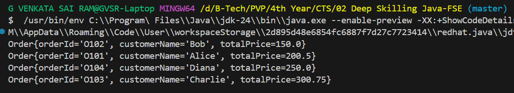

# Hands-On Exercise: Sorting Customer Orders

## Scenario
You are tasked with sorting customer orders by their total price on an e-commerce platform. This helps in prioritizing high-value orders.

## Steps

1.	Understand Sorting Algorithms:
    * Explain different sorting algorithms (Bubble Sort, Insertion Sort, Quick Sort, Merge Sort).
2.	Setup:
    * Create a class Order with attributes like orderId, customerName, and totalPrice.
3.	Implementation:
    * Implement Bubble Sort to sort orders by totalPrice.
    * Implement Quick Sort to sort orders by totalPrice.
4.	Analysis:
    * Compare the performance (time complexity) of Bubble Sort and Quick Sort.
    * Discuss why Quick Sort is generally preferred over Bubble Sort.

### Order Class Implementation
```java
public class Order {
    String orderId;
    String customerName;
    double totalPrice;
    
    public Order(String orderId, String customerName, double totalPrice) {
        this.orderId = orderId;
        this.customerName = customerName;
        this.totalPrice = totalPrice;
    }

    @Override
    public String toString() {
        return "Order{" +
                "orderId='" + orderId + '\'' +
                ", customerName='" + customerName + '\'' +
                ", totalPrice=" + totalPrice +
                '}';
    }
}
```

### Main Class Implementation
```java
public class Main {
    public static void main(String[] args) {
        Order[] orders = {
            new Order("O101", "Alice", 200.50),
            new Order("O102", "Bob", 150.00),
            new Order("O103", "Charlie", 300.75),
            new Order("O104", "Diana", 250.00)
        };

        // Uncomment one of the following based on which sort you want to run

        // --- Bubble Sort ---
        // bubbleSort(orders);

        // --- Quick Sort ---
        quickSort(orders, 0, orders.length - 1);

        for (Order order : orders) {
            System.out.println(order);
        }
    }

    // Bubble Sort Method
    public static void bubbleSort(Order[] orders) {
        int n = orders.length;
        for (int i = 0; i < n - 1; i++) {
            for (int j = 0; j < n - i - 1; j++) {
                if (orders[j].totalPrice > orders[j + 1].totalPrice) {
                    Order temp = orders[j];
                    orders[j] = orders[j + 1];
                    orders[j + 1] = temp;
                }
            }
        }
    }

    // Quick Sort Method
    public static void quickSort(Order[] orders, int low, int high) {
        if (low < high) {
            int pi = partition(orders, low, high);
            quickSort(orders, low, pi - 1);
            quickSort(orders, pi + 1, high);
        }
    }

    private static int partition(Order[] orders, int low, int high) {
        double pivot = orders[high].totalPrice;
        int i = low - 1;
        for (int j = low; j < high; j++) {
            if (orders[j].totalPrice <= pivot) {
                i++;
                Order temp = orders[i];
                orders[i] = orders[j];
                orders[j] = temp;
            }
        }
        Order temp = orders[i + 1];
        orders[i + 1] = orders[high];
        orders[high] = temp;
        return i + 1;
    }
}
```

## Output



### Explain different sorting algorithms (Bubble Sort, Insertion Sort, Quick Sort, Merge Sort)
- **Bubble Sort**: A simple comparison-based algorithm that repeatedly steps through the list, compares adjacent elements, and swaps them if they are in the wrong order. It has a time complexity of O(n^2) in the worst case.
- **Insertion Sort**: Builds a sorted array one element at a time by repeatedly taking the next element and inserting it into the correct position in the already sorted part of the array. It has a time complexity of O(n^2) in the worst case.
- **Quick Sort**: A divide-and-conquer algorithm that selects a 'pivot' element and partitions the array into two halves, recursively sorting the sub-arrays. It has an average time complexity of O(n log n) and is generally faster than Bubble Sort.
- **Merge Sort**: Another divide-and-conquer algorithm that divides the array into halves, sorts each half, and then merges them back together. It has a time complexity of O(n log n) and is stable.
