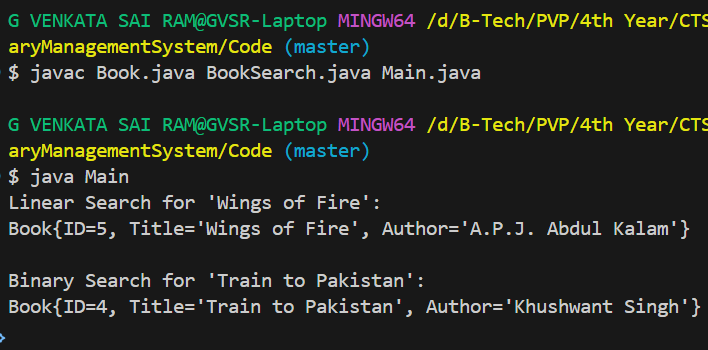

# Hands-On Exercise: Library Management System
## Scenario
You are developing a library management system where users can search for books by title or author.
Steps:
1.	Understand Search Algorithms:
    * Explain linear search and binary search algorithms.
2.	Setup:
    * Create a class Book with attributes like bookId, title, and author.
3.	Implementation:
    * Implement linear search to find books by title.
    * Implement binary search to find books by title (assuming the list is sorted).
4.	Analysis:
    * Compare the time complexity of linear and binary search.
    * Discuss when to use each algorithm based on the data set size and order.


### Book Class Implementation
```java
public class Book {
    int bookId;
    String title;
    String author;

    public Book(int bookId, String title, String author) {
        this.bookId = bookId;
        this.title = title;
        this.author = author;
    }

    @Override
    public String toString() {
        return "Book{" +
               "ID=" + bookId +
               ", Title='" + title + '\'' +
               ", Author='" + author + '\'' +
               '}';
    }
}
```

### Book Search Implementation
```java
import java.util.Arrays;
import java.util.Comparator;

public class BookSearch {

    public static Book linearSearch(Book[] books, String title) {
        for (Book book : books) {
            if (book.title.equalsIgnoreCase(title)) {
                return book;
            }
        }
        return null;
    }

    public static Book binarySearch(Book[] books, String title) {
        Arrays.sort(books, Comparator.comparing(b -> b.title.toLowerCase()));
        int left = 0;
        int right = books.length - 1;

        while (left <= right) {
            int mid = left + (right - left) / 2;
            int cmp = books[mid].title.compareToIgnoreCase(title);
            if (cmp == 0) {
                return books[mid];
            } else if (cmp < 0) {
                left = mid + 1;
            } else {
                right = mid - 1;
            }
        }
        return null;
    }
}
```

### Main
```java
public class Main {
    public static void main(String[] args) {
        Book[] books = {
            new Book(1, "The White Tiger", "Aravind Adiga"),
            new Book(2, "Midnight's Children", "Salman Rushdie"),
            new Book(3, "The God of Small Things", "Arundhati Roy"),
            new Book(4, "Train to Pakistan", "Khushwant Singh"),
            new Book(5, "Wings of Fire", "A.P.J. Abdul Kalam")
        };

        System.out.println("Linear Search for 'Wings of Fire':");
        Book foundLinear = BookSearch.linearSearch(books, "Wings of Fire");
        if (foundLinear != null) {
            System.out.println(foundLinear);
        } else {
            System.out.println("Book not found.");
        }

        System.out.println("\nBinary Search for 'Train to Pakistan':");
        Book foundBinary = BookSearch.binarySearch(books, "Train to Pakistan");
        if (foundBinary != null) {
            System.out.println(foundBinary);
        } else {
            System.out.println("Book not found.");
        }
    }
}
```

## Output


### Explain linear search and binary search algorithms
- **Linear Search**: This algorithm checks each element in the list sequentially until it finds the target value or reaches the end of the list. It has a time complexity of O(n), where n is the number of elements in the list.
- **Binary Search**: This algorithm works on sorted lists. It divides the list into halves and eliminates half of the elements in each step until it finds the target value or determines that it is not present. It has a time complexity of O(log n).