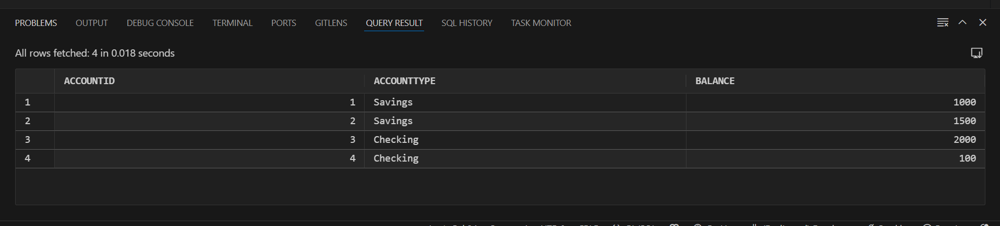
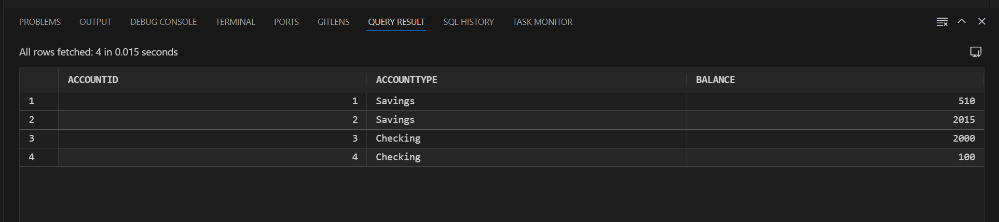
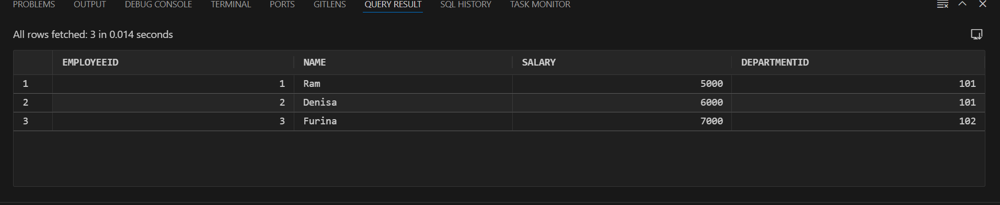
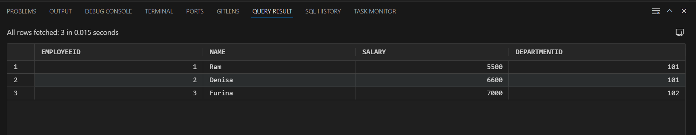
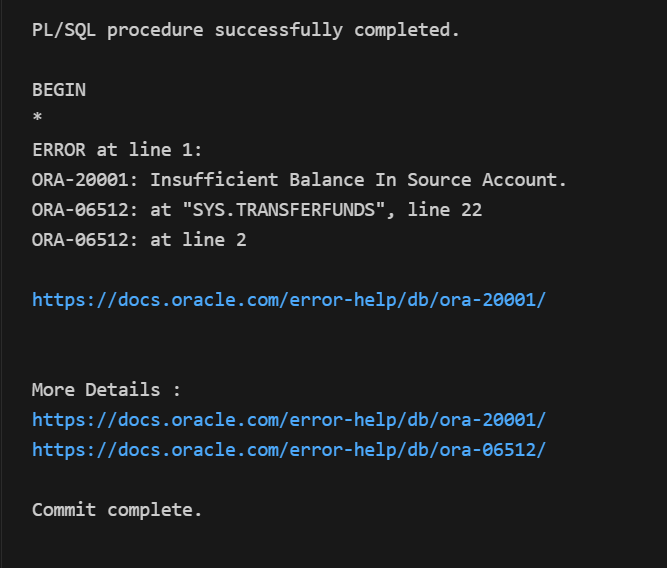

# 🧾 Exercise 3: PL/SQL Stored Procedures

## 📘 Scenario 1: Monthly Interest for Savings Accounts

**Question:**
Create a stored procedure to process monthly interest for all savings accounts.

* Procedure name: `ProcessMonthlyInterest`
* Adds 1% interest to all accounts with type `'Savings'`
* Executed without any input parameters

📸 **Before Interest Update:**


📸 **After Interest Update:**


## 📘 Scenario 2: Department-Based Employee Bonus

**Question:**
Create a stored procedure that updates employee salaries based on department and a given bonus percentage.

* Procedure name: `UpdateEmployeeBonus`
* Inputs: `DeptId`, `BonusPercent`
* Adds the percentage bonus to employees of that department

📸 **Before Bonus Update:**


📸 **After Bonus Update:**


## 📘 Scenario 3: Fund Transfer Between Accounts

**Question:**
Create a stored procedure to transfer funds between two accounts.

* Procedure name: `TransferFunds`
* Inputs: `FromAccountId`, `ToAccountId`, `Amount`
* Checks balance and transfers if sufficient funds exist, else throws error

📸 **Before Transfer (With Error):**


📸 **Successful Transfer – Updated Balance:**


## ▶️ How to Run

```sql
-- Run monthly interest for savings accounts
EXEC ProcessMonthlyInterest;

-- Add 10% bonus to employees in department 101
EXEC UpdateEmployeeBonus(101, 10);

-- Attempt fund transfer
EXEC TransferFunds(1, 2, 500);
```