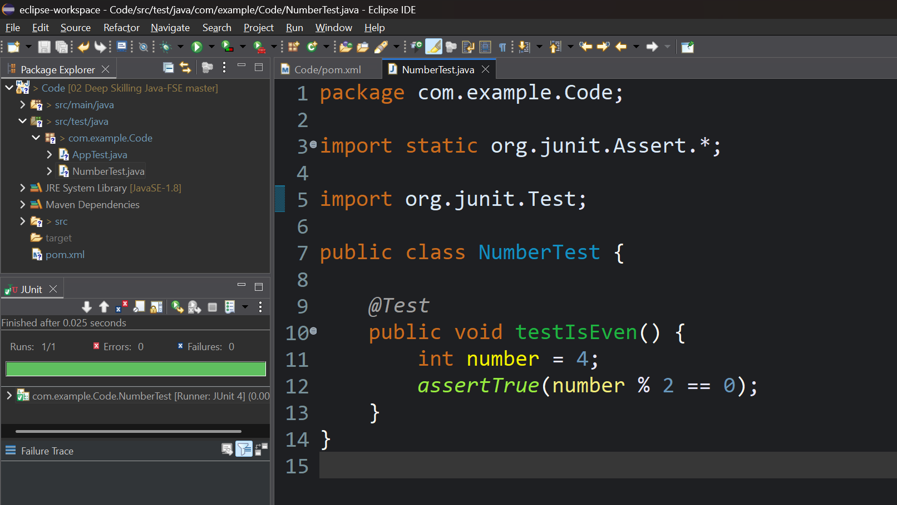

# ✅ Exercise 1: Setting Up JUnit

## 📘 Scenario

You need to set up JUnit in your Java project to start writing unit tests.

### 🧩 Steps:

1. Create a new Java project in your IDE (e.g., IntelliJ IDEA, Eclipse).

2. Add JUnit dependency to your project. If you are using Maven, add the following to your [`pom.xml`](./Code/pom.xml) *(click to visit)*:

   ```xml
   <dependency> 
     <groupId>junit</groupId> 
     <artifactId>junit</artifactId> 
     <version>4.13.2</version> 
     <scope>test</scope> 
   </dependency>
   ```

3. Create a new test class inside [`.\Code\src\test\java\com\example\Code`](./Code/src/test/java/com/example/Code/NumberTest.java) *(click to visit)*

## 💻 Output Screenshot

Successful JUnit test run from Eclipse:

