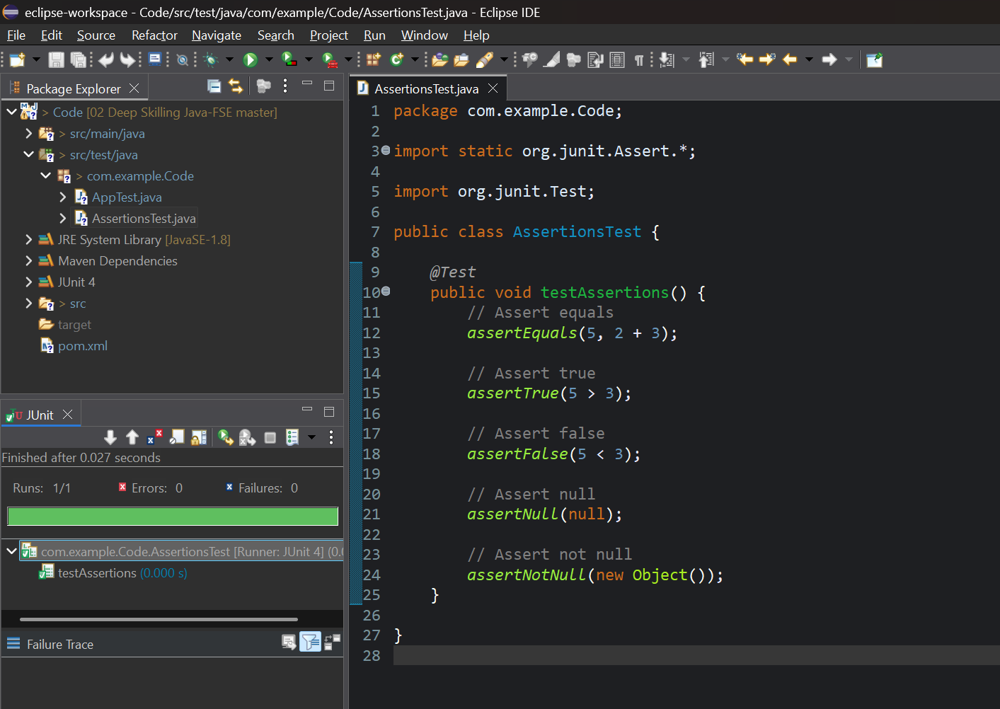

# ✅ Exercise 2: Using Assertions in JUnit

## 📘 Scenario

You are enhancing your JUnit test skills by exploring commonly used assertions such as `assertEquals`, `assertTrue`, `assertFalse`, `assertNull`, and `assertNotNull`.

### 🧩 Steps:

1. Make sure JUnit is set up in your project as in [Exercise 1](../01_setting_up_junit/README.md).

2. Write a test case to verify conditions using assertions like:

   * `assertEquals(expected, actual)`
   * `assertTrue(condition)`
   * `assertFalse(condition)`
   * `assertNull(object)`
   * `assertNotNull(object)`

3. Save the following test file inside:
   [`AssertionsTest.java`](./Code/src/test/java/com/example/Code/AssertionsTest.java) (click to visit)

## 💻 Output Screenshot

Successful execution of all assertions using Eclipse JUnit Runner:

