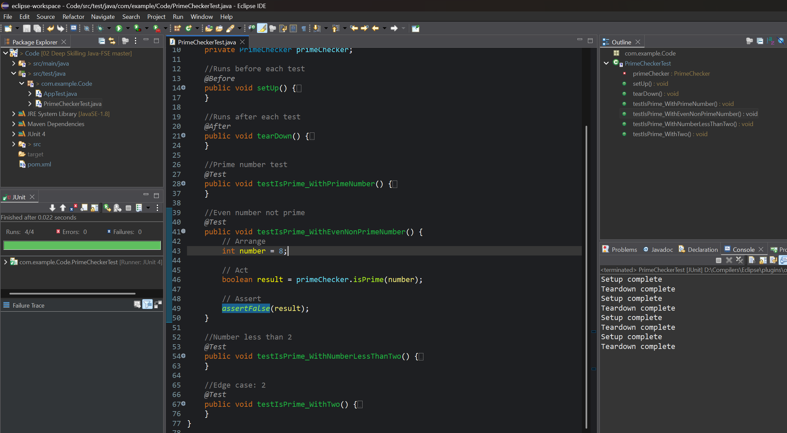
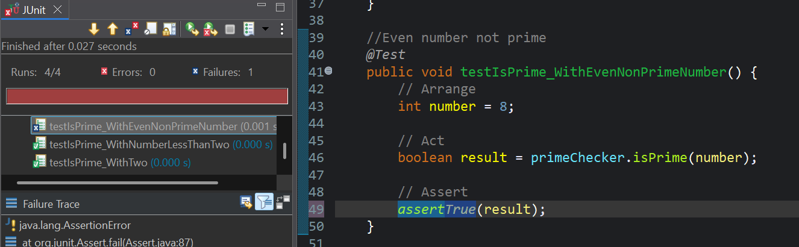

# ✅ Exercise 4: AAA Pattern, Test Fixtures, Setup and Teardown in JUnit

## 📘 Scenario

You need to organize your tests using the Arrange-Act-Assert (AAA) pattern and use setup and teardown methods to manage test context.

### 🧩 Steps:

1. ✅ Write test cases following the **AAA** pattern:

   * **Arrange**: Prepare inputs and dependencies.
   * **Act**: Invoke the method under test.
   * **Assert**: Validate results using JUnit assertions.

2. ✅ Use `@Before` and `@After` annotations:

   * `@Before` for any setup logic that runs before each test.
   * `@After` for cleanup logic that runs after each test.

## 📄 Source Files

* PrimeChecker.java → [`./Code/src/main/java/com/example/Code/PrimeChecker.java`](./Code/src/main/java/com/example/Code/PrimeChecker.java) (click to visit)
* PrimeCheckerTest.java → [`./Code/src/test/java/com/example/Code/PrimeCheckerTest.java`](./Code/src/test/java/com/example/Code/PrimeCheckerTest.java) (click to visit)

## ✅ Output - Success Case

> When all test cases pass as expected:

## ❌ Output - Failure Case

> When an assertion fails (e.g., incorrectly expecting a non-prime to be prime):

