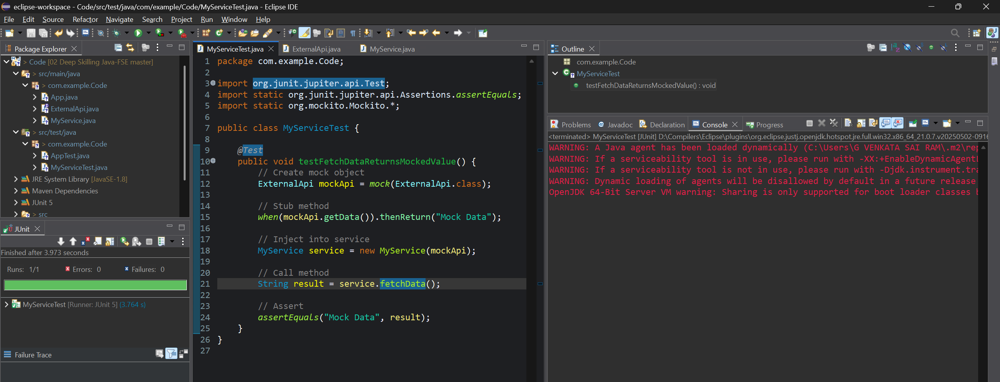

# ✅ Exercise 1: Mocking and Stubbing

## 📘 Scenario

You need to test a service that depends on an external API. Use Mockito to mock the external API and stub its methods.

### 🧩 Steps

1. Create a mock object for the external API.
2. Stub the methods to return predefined values.
3. Write a test case that uses the mock object.

## 📦 Code Structure

* Main Service: [`./Code/src/main/java/com/example/Code/MyService.java`](./Code/src/main/java/com/example/Code/MyService.java) (click to visit)
* External API Interface: [`./Code/src/main/java/com/example/Code/ExternalApi.java`](./Code/src/main/java/com/example/Code/ExternalApi.java) (click to visit)
* Test Class: [`./Code/src/test/java/com/example/Code/MyServiceTest.java`](./Code/src/test/java/com/example/Code/MyServiceTest.java) (click to visit)

## ✅ Output Screenshot

Successful test run using JUnit and Mockito:

