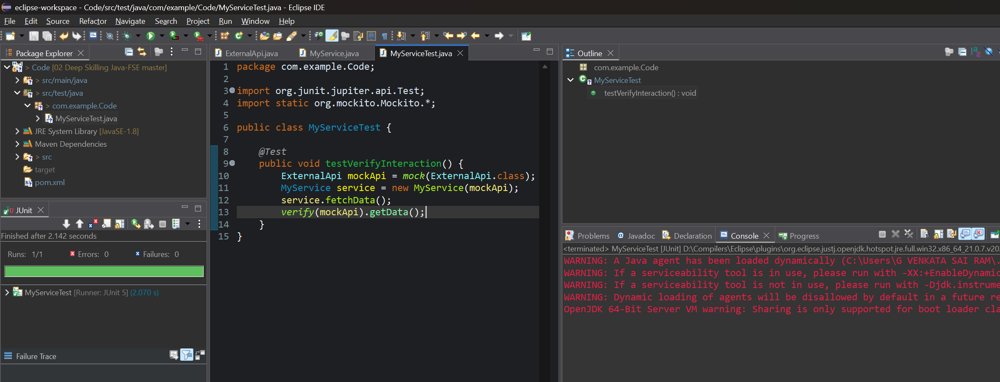

# ✅ Exercise 6: Verifying Method Calls with Mockito

## 📘 Scenario

You need to verify whether a method in the mock object was actually called during the execution of a service method.
    
## 🧩 Steps

1. Create a mock object using Mockito.
2. Call the method that is expected to trigger the mock’s method.
3. Use `verify()` to check if the mock’s method was invoked.

## 🧪 Test and Source Code

* **Test File**: [`MyServiceTest.java`](./Code/src/test/java/com/example/Code/MyServiceTest.java) (click to visit)
* **Main Classes**:

  * [`MyService.java`](./Code/src/main/java/com/example/Code/MyService.java) (click to visit)
  * [`ExternalApi.java`](./Code/src/main/java/com/example/Code/ExternalApi.java) (click to visit)

## 🧾 Dependency Setup

Make sure your `pom.xml` contains these dependencies:

[`pom.xml`](./Code/pom.xml) (click to visit)

```xml
<dependency>
  <groupId>org.junit.jupiter</groupId>
  <artifactId>junit-jupiter</artifactId>
  <version>5.9.3</version>
  <scope>test</scope>
</dependency>

<dependency>
  <groupId>org.mockito</groupId>
  <artifactId>mockito-core</artifactId>
  <version>5.11.0</version>
  <scope>test</scope>
</dependency>
```

## 💻 Output Screenshot

Successful test verifying method interaction with the mock:

