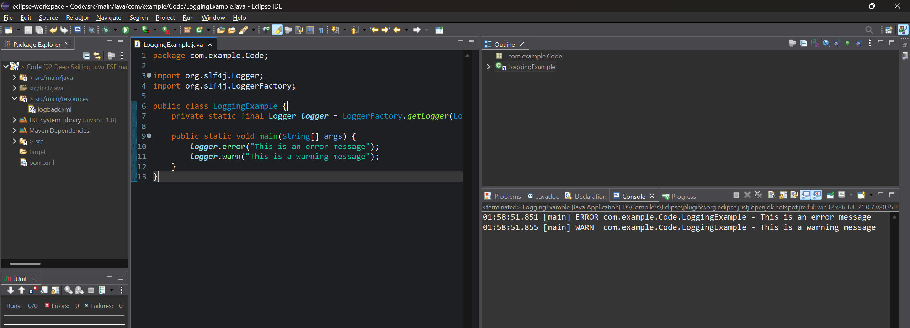

# ✅ Exercise 6: SLF4J with Logback Logging Integration

## 📘 Scenario

You need to implement logging in your Java application using **SLF4J** with the **Logback** framework. This helps in tracking and debugging application behavior through logs.

## 🧩 Steps

### 1. Configure Maven Dependencies

Update your [`pom.xml`](./pom.xml) with the required SLF4J and Logback dependencies:

```xml
<dependency>
    <groupId>org.slf4j</groupId>
    <artifactId>slf4j-api</artifactId>
    <version>1.7.30</version>
</dependency>
<dependency>
    <groupId>ch.qos.logback</groupId>
    <artifactId>logback-classic</artifactId>
    <version>1.2.3</version>
</dependency>
```

### 2. Add Configuration File

Add a `logback.xml` file inside:
[`src/main/resources`](./src/main/resources/logback.xml) (click to visit)

```xml
<configuration>
    <appender name="CONSOLE" class="ch.qos.logback.core.ConsoleAppender">
        <encoder>
            <pattern>%d{HH:mm:ss.SSS} [%thread] %-5level %logger{36} - %msg%n</pattern>
        </encoder>
    </appender>

    <root level="debug">
        <appender-ref ref="CONSOLE" />
    </root>
</configuration>
```


### 3. Create Logging Class

Place your Java logging implementation in:
[`src/main/java/com/example/Code/LoggingExample.java`](./src/main/java/com/example/Code/LoggingExample.java) (click to visit)

```java
package com.example.Code;

import org.slf4j.Logger;
import org.slf4j.LoggerFactory;

public class LoggingExample {
    private static final Logger logger = LoggerFactory.getLogger(LoggingExample.class);

    public static void main(String[] args) {
        logger.error("This is an error message");
        logger.warn("This is a warning message");
    }
}
```

## 💻 Output Screenshot

Console output from Eclipse running the above code:

