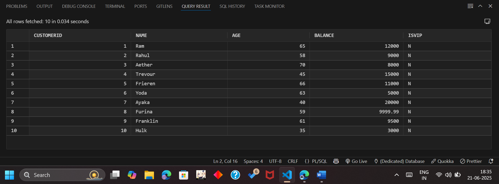
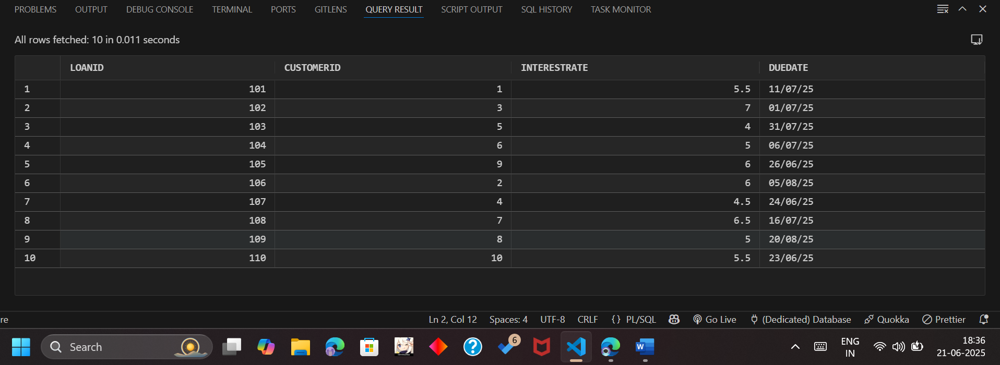
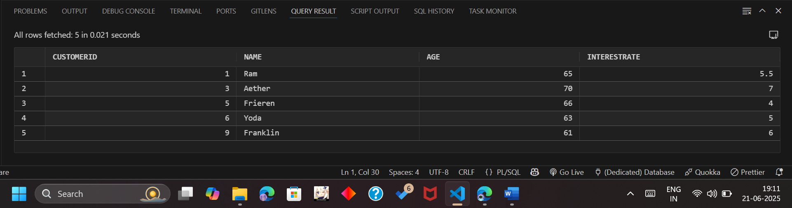
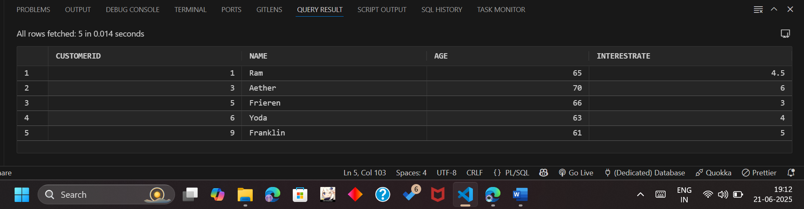
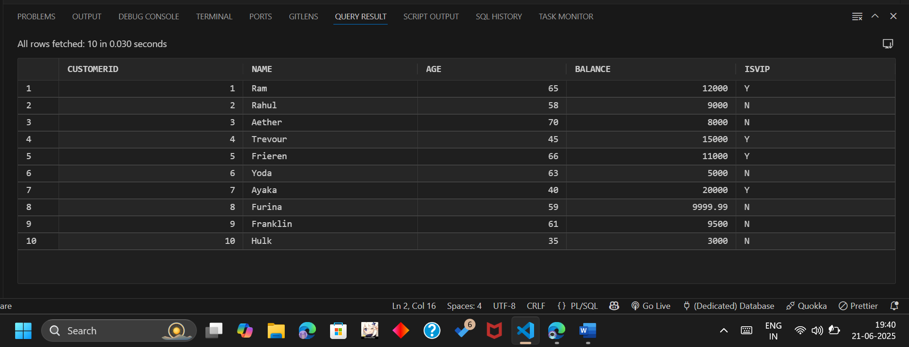
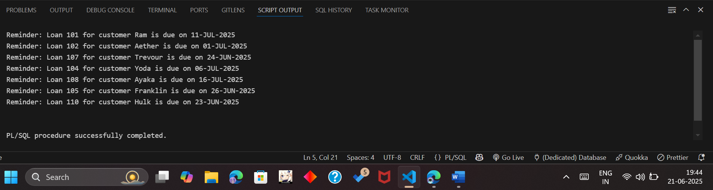

# 🏦 Exercise 1: Control Structures

### 📋 Initial Tables Overview

📎 Customers Table:  

📎 Loans Table:  

### 📘 Scenario 1: Senior Customer Interest Rate Discount

**Question:**  
Write a PL/SQL block that loops through all customers, checks their age, and if they are above 60, apply a 1% discount to their current loan interest rates.

- Used a simple `FOR` loop to select all customers aged 60 and above.
- For each, updated their loan interest rate by subtracting 1%.
- Finalized with a `COMMIT`.

📎 Before:  

📎 After:  

### 📘 Scenario 2: Promote Customer to VIP

**Question:**  
Write a PL/SQL block that iterates through all customers and sets a flag `IsVIP` to TRUE for those with a balance over $10,000.

- Selected customers with `Balance > 10000` and updated `ISVIP` column to `'Y'`.
- Loop applied to all qualifying customers and committed.

📎 After Update:  

### 📘 Scenario 3: Loan Due Reminder

**Question:**  
Write a PL/SQL block that fetches all loans due in the next 30 days and prints a reminder message for each customer.

- Fetched loans with due date between `SYSDATE` and `SYSDATE + 30`.
- Printed formatted reminder message with customer name and due date.

📎 Output:  

### ▶️ SQL Execution Order

1. Run `00_Scenario01.sql`
2. Then `00_Scenario02.sql`
3. Finally `00_Scenario03.sql`

All blocks include `COMMIT` at the end to save the changes.
