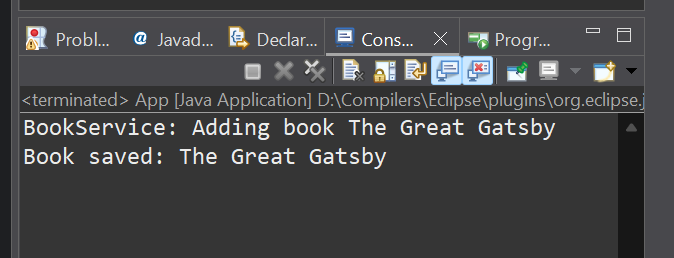

# Exercise 1: Configuring a Basic Spring Application

## 📘 Scenario

Your company is developing a web application for managing a library. You need to use the **Spring Framework** to handle the backend operations.

## 🧩 Steps

### 1️⃣ Set Up a Spring Project

* Create a Maven project named **LibraryManagement**.
* Add Spring Core dependencies in your [`pom.xml`](./Code/LibraryManagement/pom.xml) (click to visit):

```xml
<dependency>
    <groupId>org.springframework</groupId>
    <artifactId>spring-core</artifactId>
    <version>6.2.7</version>
</dependency>
<dependency>
    <groupId>org.springframework</groupId>
    <artifactId>spring-context</artifactId>
    <version>5.3.36</version>
</dependency>
<dependency>
    <groupId>junit</groupId>
    <artifactId>junit</artifactId>
    <version>3.8.1</version>
    <scope>test</scope>
</dependency>
```

### 2️⃣ Configure the Application Context

* Create an XML configuration file named [`applicationContext.xml`](./Code/LibraryManagement/src/main/resources/applicationContext.xml) (click to visit) inside `src/main/resources`.

```xml
<beans xmlns="http://www.springframework.org/schema/beans"
       xmlns:xsi="http://www.w3.org/2001/XMLSchema-instance"
       xsi:schemaLocation="
           http://www.springframework.org/schema/beans
           https://www.springframework.org/schema/beans/spring-beans.xsd">

    <!-- Define BookRepository bean -->
    <bean id="bookRepository" class="com.example.LibraryManagement.BookRepository"/>

    <!-- Define BookService bean and inject BookRepository -->
    <bean id="bookService" class="com.example.LibraryManagement.BookService">
        <property name="bookRepository" ref="bookRepository"/>
    </bean>

</beans>
```

### 3️⃣ Define Service and Repository Classes

* Create service class: [`BookService.java`](./Code/LibraryManagement/src/main/java/com/example/LibraryManagement/BookService.java) (click to visit)
* Create repository class: [`BookRepository.java`](./Code/LibraryManagement/src/main/java/com/example/LibraryManagement/BookRepository.java) (click to visit)

### 4️⃣ Run the Application

* Create main class to load Spring context and test: [`MainApp.java`](./Code/LibraryManagement/src/main/java/com/example/LibraryManagement/MainApp.java) (click to visit)

## 💻 Output Screenshot

Console output after running the Spring application:

