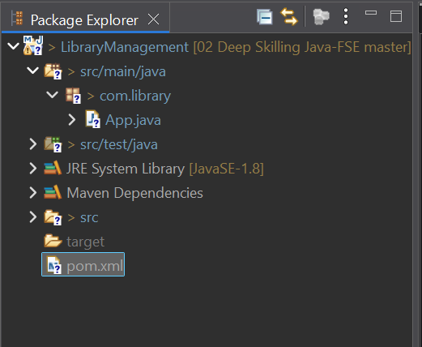

# ✅ Exercise 4: Creating and Configuring a Maven Project

## 📘 Scenario

You need to set up a new Maven project for the **Library Management** application and add Spring dependencies.

## 🧩 Steps

### 1️⃣ Create a New Maven Project

* Create a Maven project named **LibraryManagement**.

### 2️⃣ Add Spring Dependencies in `pom.xml`

Update [`pom.xml`](./Code/LibraryManagement/pom.xml) (click to visit):

```xml
<dependencies>
    <dependency>
        <groupId>junit</groupId>
        <artifactId>junit</artifactId>
        <version>3.8.1</version>
        <scope>test</scope>
    </dependency>
    <!-- Spring Context -->
    <dependency>
        <groupId>org.springframework</groupId>
        <artifactId>spring-context</artifactId>
        <version>6.2.7</version>
    </dependency>
    <!-- Spring AOP -->
    <dependency>
        <groupId>org.springframework</groupId>
        <artifactId>spring-aop</artifactId>
        <version>6.2.7</version>
    </dependency>
    <!-- Spring WebMVC -->
    <dependency>
        <groupId>org.springframework</groupId>
        <artifactId>spring-webmvc</artifactId>
        <version>6.2.8</version>
    </dependency>
</dependencies>
```

### 3️⃣ Configure Maven Plugins

Also inside [`pom.xml`](./Code/LibraryManagement/pom.xml):

```xml
<build>
    <plugins>
        <plugin>
            <groupId>org.apache.maven.plugins</groupId>
            <artifactId>maven-compiler-plugin</artifactId>
            <version>3.8.1</version>
            <configuration>
                <source>1.8</source>
                <target>1.8</target>
            </configuration>
        </plugin>
    </plugins>
</build>
```

## 💻 Output Screenshot

Successful Maven project build and Spring configuration output:


