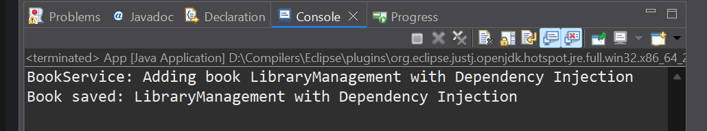

# ✅ Exercise 2: Implementing Dependency Injection

## 📘 Scenario

In the library management application, you need to manage the dependencies between the `BookService` and `BookRepository` classes using Spring’s IoC and DI.

## 🧩 Steps

### 1️⃣ Modify the XML Configuration

Update [`applicationContext.xml`](./Code/LibraryManagement/src/main/resources/applicationContext.xml) (click to visit) to wire `BookRepository` into `BookService`.

```xml
<beans xmlns="http://www.springframework.org/schema/beans"
       xmlns:xsi="http://www.w3.org/2001/XMLSchema-instance"
       xsi:schemaLocation="
           http://www.springframework.org/schema/beans
           https://www.springframework.org/schema/beans/spring-beans.xsd">

    <!-- Define BookRepository bean -->
    <bean id="bookRepository" class="com.library.repository.BookRepository"/>

    <!-- Define BookService bean and inject BookRepository -->
    <bean id="bookService" class="com.library.service.BookService">
        <property name="bookRepository" ref="bookRepository"/>
    </bean>
</beans>
```

### 2️⃣ Update the BookService Class

In [`BookService.java`](./Code/LibraryManagement/src/main/java/com/library/service/BookService.java) (click to visit), ensure a setter method for [`BookRepository`](./Code/LibraryManagement/src/main/java/com/library/repository/BookRepository.java) (click to visit) is defined to support dependency injection.

```java
private BookRepository bookRepository;

public void setBookRepository(BookRepository bookRepository) {
    this.bookRepository = bookRepository;
}
```

### 3️⃣ Test the Configuration

Run the main class [`App.java`](./Code/LibraryManagement/src/main/java/com/library/App.java) (click to visit) to verify the dependency injection setup.

## 💻 Output Screenshot

Console output after running the updated Spring application:

