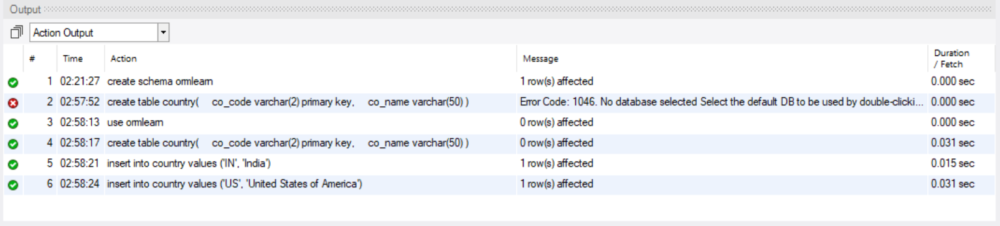
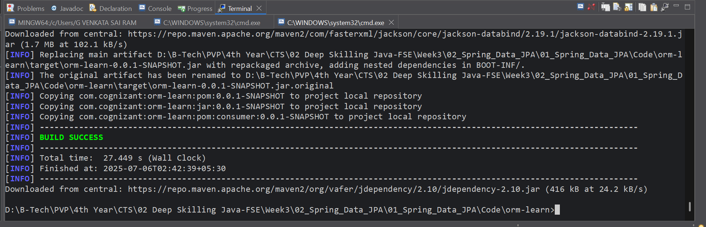
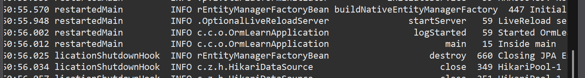
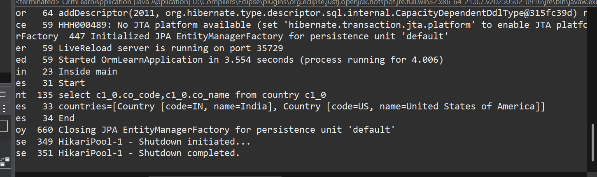

# ✅ Hands-on 1: Spring Data JPA - Quick Example

## 📘 Scenario

You are building a demo project to understand Spring Data JPA and Hibernate using MySQL.

## 💻 Software Pre-requisites

* MySQL Server 8.0
* MySQL Workbench 8
* Eclipse IDE for Enterprise Java Developers (2019-03 R)
* Maven 3.6.2

## 🧩 Steps

### 1️⃣ Create a Spring Boot Project

* Go to [Spring Initializr](https://start.spring.io/)
* Set **Group**: `com.cognizant`
* Set **Artifact**: `orm-learn`
* Description: "Demo project for Spring Data JPA and Hibernate"
* Select:

  * Spring Boot DevTools
  * Spring Data JPA
  * MySQL Driver
* Generate, extract, and import into Eclipse (`File > Import > Maven > Existing Maven Projects`).

### 2️⃣ MySQL Schema Setup

```sql
create schema ormlearn;
```



### 3️⃣ Configure `application.properties`

Located in `src/main/resources/application.properties`.
👉 [Click to visit](./Code/orm-learn/src/main/resources/application.properties)

### 4️⃣ Build the Project

```bash
mvn clean package -Dhttp.proxyHost=proxy.cognizant.com -Dhttp.proxyPort=6050 -Dhttps.proxyHost=proxy.cognizant.com -Dhttps.proxyPort=6050 -Dhttp.proxyUser=123456
```



### 5️⃣ Verify `main()` Method

Located in [`OrmLearnApplication.java`](./Code/orm-learn/src/main/java/com/cognizant/orm_learn/OrmLearnApplication.java) (click to visit).



## 💾 Database Table

[`Query.sql`](./Code/Queries/01_creating_schema.sql) (click to visit)

```sql
create table country (
  co_code varchar(2) primary key,
  co_name varchar(50)
);

insert into country values ('IN', 'India');
insert into country values ('US', 'United States of America');
```

## 📄 Entity Class

[`Country.java`](./Code/orm-learn/src/main/java/com/cognizant/orm_learn/model/Country.java) (click to visit)

## 📄 Repository Interface

[`CountryRepository.java`](./Code/orm-learn/src/main/java/com/cognizant/orm_learn/repository/CountryRepository.java) (click to visit)

## 💼 Service Class

[`CountryService.java`](./Code/orm-learn/src/main/java/com/cognizant/orm_learn/service/CountryService.java) (click to visit)

## ✅ Test Method in Main Class

Check [`OrmLearnApplication.java`](./Code/orm-learn/src/main/java/com/cognizant/orm_learn/OrmLearnApplication.java) for the test logic (click to visit).

## 💻 Output Screenshot



## ✅ Run & Verify

* Run `OrmLearnApplication.java`.
* Check logs for retrieved country data.