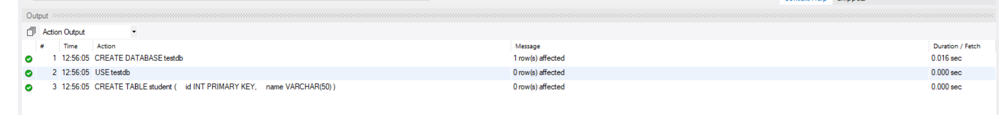
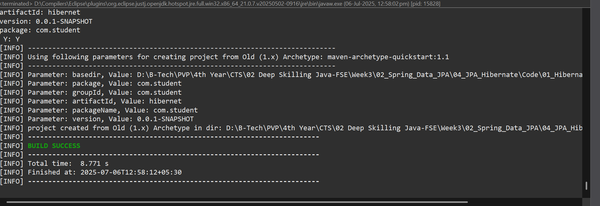
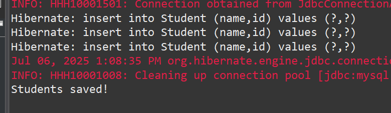
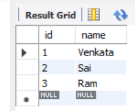

# 📄 Hands-on: Hibernate Basic Example with MySQL

## 💡 Scenario

We are creating a simple Maven-based Java application using Hibernate ORM to persist student details into a MySQL database.

## 🧩 Steps

### 1️⃣ Create a Maven Project

* Create a new Maven project named `hibernet`.
* Add Hibernate and MySQL dependencies in [`pom.xml`](./hibernet/pom.xml) (click to visit).

### 2️⃣ Configure Database

* Create a MySQL database named **testdb** and a table `student` with columns `id` and `name`.

```sql
create database testdb;
use testdb;
create table student(id int primary key, name varchar(50));
```

### 3️⃣ Create Hibernate Configuration

* Add `hibernate.cfg.xml` in `src/main/resources` directory.
  This file includes database connection details, dialect, and mapping.

[Click to visit `hibernate.cfg.xml`](./hibernet/src/main/resources/hibernate.cfg.xml)

### 4️⃣ Create Entity Class

* Create `Student.java` entity class in `com.student` package.
* Annotate with Hibernate mappings.

[Click to visit `Student.java`](./hibernet/src/main/java/com/student/Student.java)

### 5️⃣ Create Application Class

* Create `App.java` in `com.student` package.
* Add logic to create and save multiple student records.

[Click to visit `App.java`](./hibernet/src/main/java/com/student/App.java)

## ▶️ Running the Application

* Build the project using Maven (verify **BUILD SUCCESS**).

## 💻 Output Screenshots

* ✅ MySQL schema and table creation:
  

* ✅ Maven build success:
  

* ✅ Hibernate console insert logs & success message:
  

* ✅ MySQL data verification (students inserted):
  

## ✅ Conclusion

After executing the application, student records are successfully inserted into the MySQL `student` table using Hibernate ORM.
