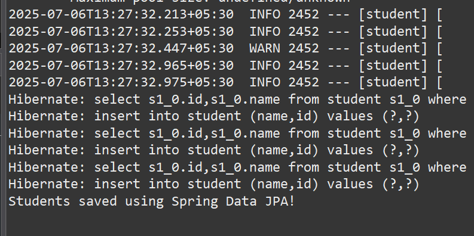
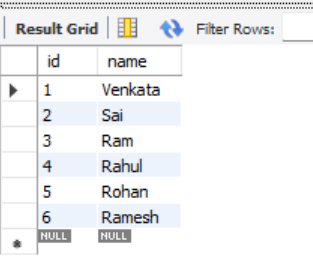

# 📄 Hands-on: Spring Data JPA Basic Example with MySQL

## 💡 Scenario

We are creating a simple Maven-based Java application using **Spring Data JPA** and Hibernate to persist student details into a MySQL database.

## 🧩 Steps

### 1️⃣ Create a Maven Project

* Create a new Maven project named `hibernet` using **Spring Initializr**.
* Add **Spring Data JPA**, **Hibernate**, and **MySQL Driver** dependencies in [`pom.xml`](./student/pom.xml) (click to visit).

### 2️⃣ Configure Database

* Create a MySQL database named **testdb** and a table `student` with columns `id` and `name`.

```sql
create database testdb;
use testdb;
create table student(id int primary key, name varchar(50));
```

### 3️⃣ Configure Application Properties

* Add [`application.properties`](./student/src/main/resources/application.properties) (click to visit) in `src/main/resources`.
* Configure database connection, JPA properties, and logging.

### 4️⃣ Create Entity Class

* Create `Student.java` entity class in `com.student` package.
* Annotate with `@Entity` and map fields to table columns.

[Click to visit `Student.java`](./student/src/main/java/com/example/student/model/Student.java)

### 5️⃣ Create Repository Interface

* Create `StudentRepository.java` in `com.student` package.
* Extend `JpaRepository<Student, Integer>`.

[Click to visit `StudentRepository.java`](./student/src/main/java/com/example/student/repository/StudentRepository.java)

### 6️⃣ Create Main Application Class

* Create `StudentApplication.java` in `com.student` package.
* Autowire `StudentRepository`.
* Add logic to save multiple student records.

[Click to visit `StudentApplication.java`](./student/src/main/java/com/example/student/StudentApplication.java)

## ▶️ Running the Application

* Build and run the project using Maven (verify **BUILD SUCCESS**).

## 💻 Output Screenshots

* ✅ Spring Data JPA build success:
  

* ✅ MySQL data verification (students inserted):
  

## ✅ Conclusion

After running the application, student records are successfully inserted into the MySQL `student` table using **Spring Data JPA**, demonstrating basic CRUD integration with Spring and Hibernate.