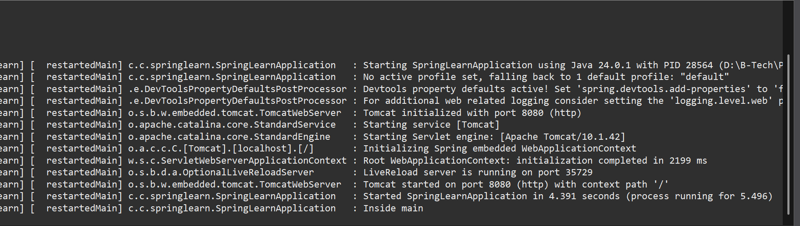

# ✅ Hands-on 1: Spring Web Project using Maven

## 💡 Scenario

We are creating a **Spring Web project** using Maven and Spring Initializr. We will set up, build, and run the application, verifying that the `main()` method executes successfully.

## 🧩 Steps

### 1️⃣ Create Spring Maven Project

* Go to [Spring Initializr](https://start.spring.io/)
* Set:

  * **Group**: `com.cognizant`
  * **Artifact Id**: `spring-learn`
* Select dependencies:

  * Spring Boot DevTools
  * Spring Web
* Generate and download the project as a ZIP file.

### 2️⃣ Setup in Eclipse

* Extract the ZIP file into your Eclipse Workspace root folder.
* Open terminal and build the project:

```bash
mvn clean package -Dhttp.proxyHost=proxy.cognizant.com -Dhttp.proxyPort=6050 -Dhttps.proxyHost=proxy.cognizant.com -Dhttps.proxyPort=6050 -Dhttp.proxyUser=123456
```

* Import into Eclipse:

  * **File > Import > Maven > Existing Maven Projects > Browse to extracted folder > Finish**


### 3️⃣ Verify Application

* Include logs in `SpringLearnApplication.java` to confirm `main()` method execution:

```java
private static final Logger LOGGER = LoggerFactory.getLogger(SpringLearnApplication.class);

public static void main(String[] args) {
    SpringApplication.run(SpringLearnApplication.class, args);
    LOGGER.info("Inside main");
}
```

* Run `SpringLearnApplication` as a Java application.


## 🗂️ Project Structure & Files

### 🔥 Application Code

[`./Code/spring-learn/src/main/java/com/cognizant/springlearn/SpringLearnApplication.java`](./Code/spring-learn/src/main/java/com/cognizant/springlearn/SpringLearnApplication.java) (click to visit)

### ⚙️ Configuration Files

[`./Code/spring-learn/src/main/resources`](./Code/spring-learn/src/main/resources) (click to visit)

### 📄 Maven Configuration

[`pom.xml`](./Code/spring-learn/pom.xml) (click to visit)

## 💡 Key Points

✅ **src/main/java** — Contains application logic and main classes.
✅ **src/main/resources** — Holds configuration files (e.g., application.properties).
✅ **src/test/java** — Contains test classes for unit or integration testing.
✅ **SpringLearnApplication.java** — Entry point of the app, containing `main()` method.
✅ `@SpringBootApplication` — Combines `@Configuration`, `@EnableAutoConfiguration`, and `@ComponentScan`. It enables Spring Boot’s auto-configuration and component scanning.

## 💻 Output Screenshot

✅ Application console output confirming `main()` execution:



## ✅ Conclusion

After running the project, you should see the log message **"Inside main"** printed in the console, confirming that the Spring application has started successfully.
