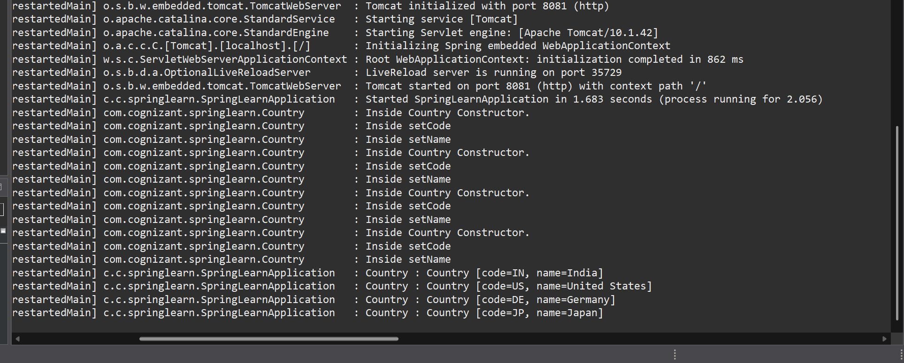

# ✅ Hands-on 4: Spring Core — Load Country from Spring Configuration XML

## 💡 Scenario

An airlines website supports booking for multiple countries. The country list includes:

| Code | Name          |
| ---- | ------------- |
| US   | United States |
| DE   | Germany       |
| IN   | India         |
| JP   | Japan         |

In this exercise, we will store one country in an XML Spring configuration and load it using Spring Core.

## 🧩 Steps

### 1️⃣ Create Country Configuration

* Create a Spring XML configuration file: [`country.xml`](./Code/spring-learn/src/main/resources/country.xml) (click to visit).
* Add a bean definition for one country (e.g., India):

```xml
<bean id="country" class="com.cognizant.springlearn.Country">
    <property name="code" value="IN"/>
    <property name="name" value="India"/>
</bean>
```

### 2️⃣ Create Country Class

* Create a `Country` class: [`Country.java`](./Code/spring-learn/src/main/java/com/cognizant/springlearn/Country.java) (click to visit).
* Add:

  * `code` and `name` instance variables.
  * Empty constructor with debug log: **"Inside Country Constructor."**
  * Getter and setter methods, each with debug logs.
  * `toString()` method to print details.


### 3️⃣ Update Main Application

* In [`SpringLearnApplication.java`](./spring-learn/src/main/java/com/cognizant/springlearn/SpringLearnApplication.java) (click to visit):

  * Create a `displayCountry()` method:

    ```java
    ApplicationContext context = new ClassPathXmlApplicationContext("country.xml");
    Country country = (Country) context.getBean("country", Country.class);
    LOGGER.debug("Country : {}", country.toString());
    ```

  * Call `displayCountry()` in the `main()` method.

## 🔎 Explanation

### 💬 XML Tags & Attributes

* **bean tag**: Defines a Spring bean.
* **id**: Unique identifier for the bean.
* **class**: Fully qualified class name.
* **property tag**: Used to inject values.
* **name**: Name of the property.
* **value**: Value to assign.

### 💬 ApplicationContext & ClassPathXmlApplicationContext

* `ApplicationContext`: Spring container that manages beans and their lifecycle.
* `ClassPathXmlApplicationContext`: Loads configuration from an XML file on the classpath.

### 💬 What happens on `context.getBean()`

* Spring container instantiates the bean defined in XML.
* Calls the constructor and setter methods.
* Returns a fully initialized object.

## 💻 Output Screenshot

✅ Console output confirming constructor and setter invocation:



## ✅ Conclusion

After running the project, you will see logs showing:

* Country constructor executed.
* Setters executed.
* Final country object details.
