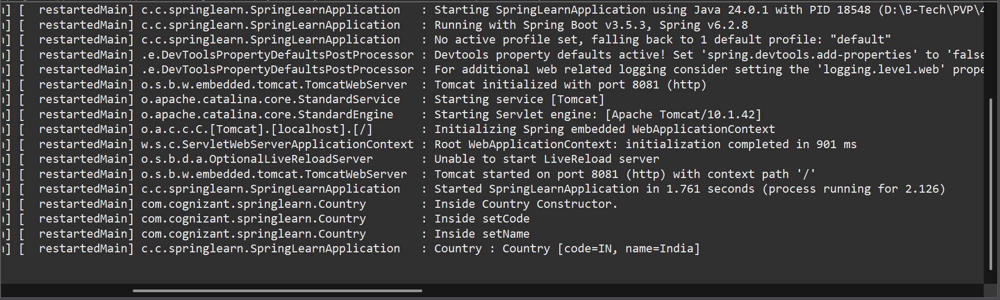
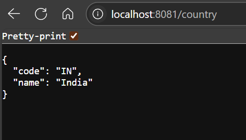

# ✅ Hands-on: REST — Country Web Service

## 💡 Scenario

Extend the *spring-learn* application to provide a REST API that returns India’s country details as a JSON response.

## 🧩 Steps

### 1️⃣ Create Controller

* Create a controller class: [`CountryController.java`](./Code/spring-learn/src/main/java/com/cognizant/springlearn/controller/CountryController.java) (click to visit).

* Annotate the class with `@RestController`.

* Define a method `getCountryIndia()`:

```java
@RequestMapping("/country")
public Country getCountryIndia() {
    ApplicationContext context = new ClassPathXmlApplicationContext("country.xml");
    Country country = context.getBean("country", Country.class);
    return country;
}
```

### 2️⃣ Configure XML

* Use existing Spring XML config: [`country.xml`](./Code/spring-learn/src/main/resources/country.xml) (click to visit).
* Make sure it contains the `country` bean for India:

```xml
<bean id="country" class="com.cognizant.springlearn.Country">
    <property name="code" value="IN"/>
    <property name="name" value="India"/>
</bean>
```

### 3️⃣ Run Application

* Start [`SpringLearnApplication.java`](./Code/spring-learn/src/main/java/com/cognizant/springlearn/SpringLearnApplication.java) (click to visit).
* Access in browser or Postman:

  ```
  http://localhost:8083/country
  ```

## 💻 Sample Response

```json
{
  "code": "IN",
  "name": "India"
}
```

## 📄 Explanation

### 💬 What happens in the controller method?

* The `getCountryIndia()` method:

  * Loads the Spring context from `country.xml`.
  * Retrieves the `country` bean.
  * Returns it directly as the response.

### 💬 How is the bean converted to JSON?

* Spring Boot uses **Jackson** (by default) to automatically convert Java objects (POJOs) to JSON when returning from a `@RestController` method.

### 💬 Headers explanation

* In **browser dev tools > Network tab**, you’ll see HTTP response headers such as:

  * `Content-Type: application/json`
  * `Status: 200 OK`

* In **Postman**, click the **Headers** tab to see similar details.

## 💻 Output Screenshots

✅ Logs & Application console output:


✅ Browser or Postman JSON response:


## ✅ Conclusion

After running the project and hitting `/country`, you'll get a JSON representation of the `Country` object with "IN" and "India".
