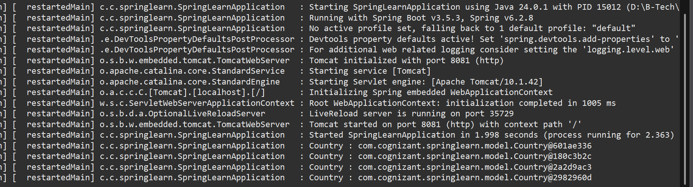
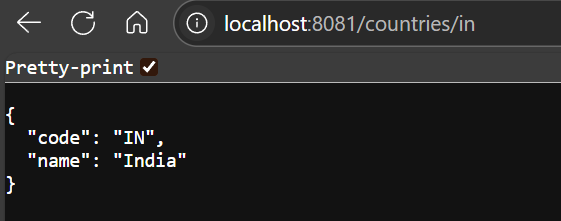
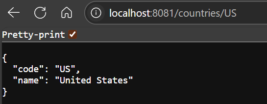

# ✅ Hands-on: REST — Get Country Based on Country Code

## 💡 Scenario

Extend your *spring-learn* application to provide a REST API that returns a country’s details based on a given country code (case insensitive).

## 🧩 Steps

### 1️⃣ Update Controller

* Controller file: [`CountryController.java`](./Code/spring-learn/src/main/java/com/cognizant/springlearn/controller/CountryController.java) (click to visit).

```java
@GetMapping("/countries/{code}")
public Country getCountry(@PathVariable String code) {
    LOGGER.info("Start getCountry");
    Country country = countryService.getCountry(code);
    LOGGER.info("End getCountry");
    return country;
}
```

### 2️⃣ Update Service

* Service file: [`CountryService.java`](./Code/spring-learn/src/main/java/com/cognizant/springlearn/service/CountryService.java) (click to visit).

```java
public Country getCountry(String code) {
    ApplicationContext context = new ClassPathXmlApplicationContext("country.xml");
    List<Country> countries = context.getBean("countryList", List.class);
    
    return countries.stream()
        .filter(c -> c.getCode().equalsIgnoreCase(code))
        .findFirst()
        .orElse(null);
}
```

### 3️⃣ Configure XML

* Make sure [`country.xml`](./Code/spring-learn/src/main/resources/country.xml) has the list of countries defined with `<util:list>` bean for `countryList`.

### 4️⃣ Run Application

* Start [`SpringLearnApplication.java`](./Code/spring-learn/src/main/java/com/cognizant/springlearn/SpringLearnApplication.java) (click to visit).
* Access sample requests in browser or Postman:

  ```
  http://localhost:8081/countries/in
  http://localhost:8081/countries/us
  ```

## 💻 Sample Responses

### 🇮🇳 India

```json
{
  "code": "IN",
  "name": "India"
}
```

### 🇺🇸 United States

```json
{
  "code": "US",
  "name": "United States"
}
```

## 🗂 Logs

✅ Console logs for each request:

```
INFO  Start getCountry
INFO  End getCountry
```

## 💻 Output Screenshots

* ✅ Logs and console output:
  

* ✅ India response:
  

* ✅ US response:
  

## ✅ Conclusion

After running and accessing `/countries/{code}`, the app correctly returns JSON details for the matching country code, case insensitive.