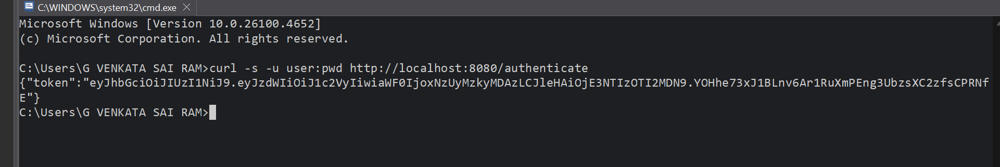
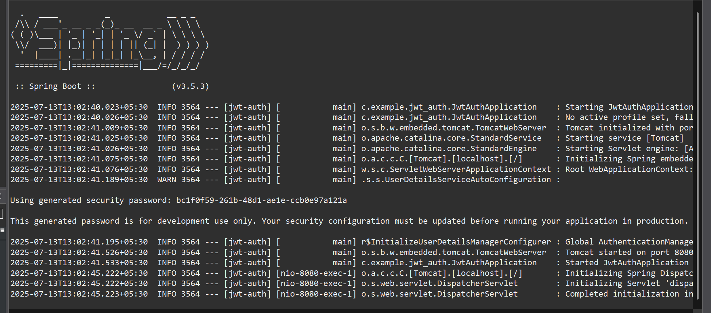

# ✅ Hands-on: Create Authentication Service that Returns JWT

## 💡 Scenario

We are implementing an authentication service in a Spring Boot application. When valid user credentials are provided, the service generates and returns a JWT (JSON Web Token).

## 🧩 Steps

### 1️⃣ Create Authentication Controller

* Create a controller to handle the `/authenticate` endpoint.
* Controller file: [`JwtUtil.java`](./Code/jwt-auth/src/main/java/com/example/jwt_auth/JwtUtil.java) (click to visit).

### 2️⃣ Configure Security

* Configure authentication and authorization logic using Spring Security.
* Configuration file: [`SecurityConfig.java`](./Code/jwt-auth/src/main/java/com/example/jwt_auth/SecurityConfig.java) (click to visit).

### 3️⃣ Main Application

* Entry point of the application: [`JwtAuthApplication.java`](./Code/jwt-auth/src/main/java/com/example/jwt_auth/JwtAuthApplication.java) (click to visit).

### 4️⃣ Read Authorization Header

* In the controller, decode credentials passed through the `Authorization` header (Base64 encoded).
* Validate the username and password.

### 5️⃣ Generate JWT Token

* Use `JwtUtil` to generate a JWT token for the authenticated user.
* Sample JSON response:

```json
{"token":"<generated_jwt_token>"}
```

## ▶️ Request Example

```bash
curl -s -u user:pwd http://localhost:8090/authenticate
```

## 💻 Output Screenshots

✅ Terminal output:


✅ Application logs:


## ⚙️ Configuration Files

* [`pom.xml`](./Code/jwt-auth/pom.xml) (click to visit) — Maven dependencies configuration.
* [`application.properties`](./Code/jwt-auth/src/main/resources/application.properties) (click to visit) — Application-level properties.

## 🗂 Important Files

| File                                 | Description                      |
| ------------------------------------ | -------------------------------- |
| `JwtAuthApplication.java`            | Main Spring Boot application     |
| `JwtUtil.java`                       | Utility to generate JWT          |
| `SecurityConfig.java`                | Spring Security configuration    |
| `application.properties`             | App configuration properties     |
| [`pom.xml`](./Code/jwt-auth/pom.xml) | Maven dependencies configuration |

## ✅ Conclusion

After executing the `curl` request, you receive a valid JWT token in the response. This token can then be used to authorize further secure API calls.