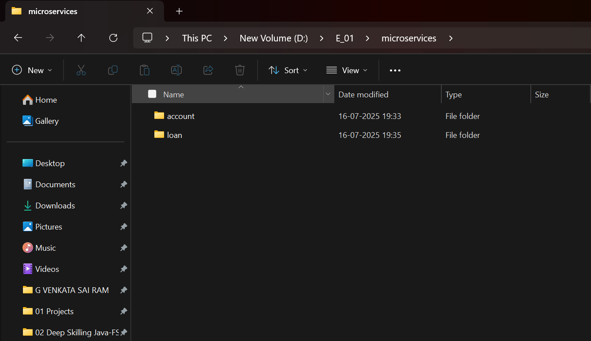
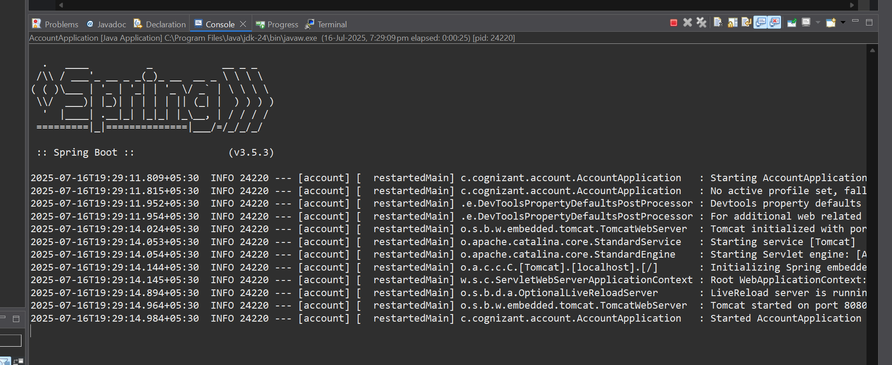
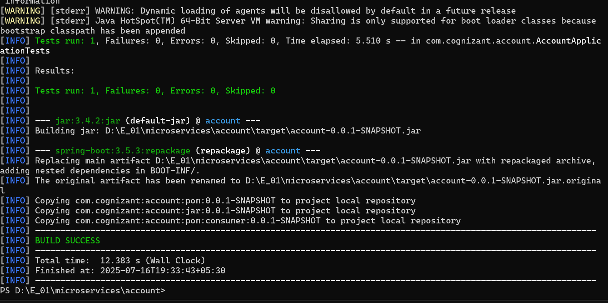
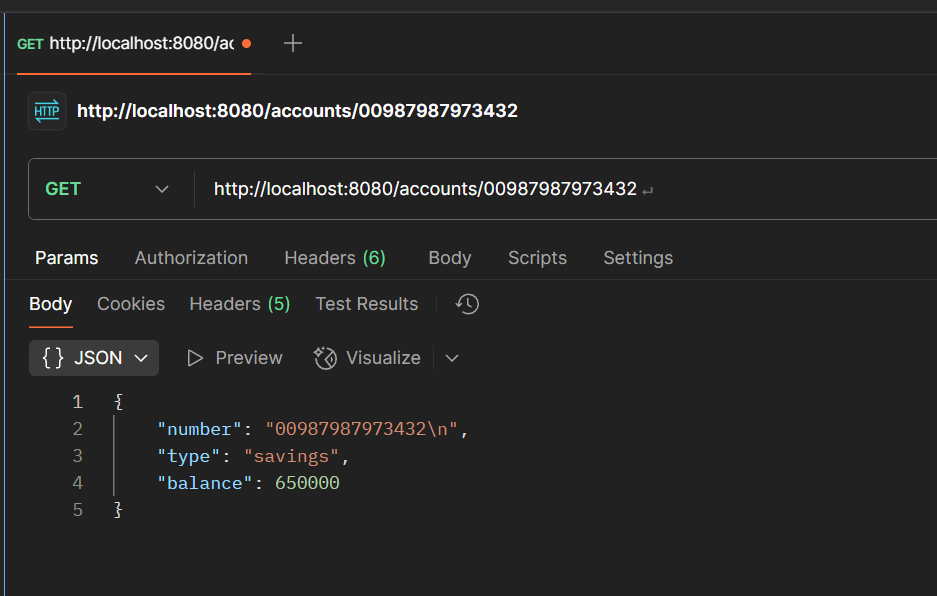
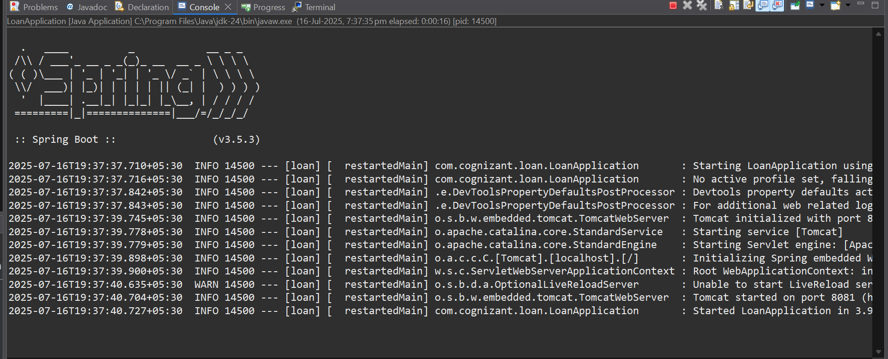
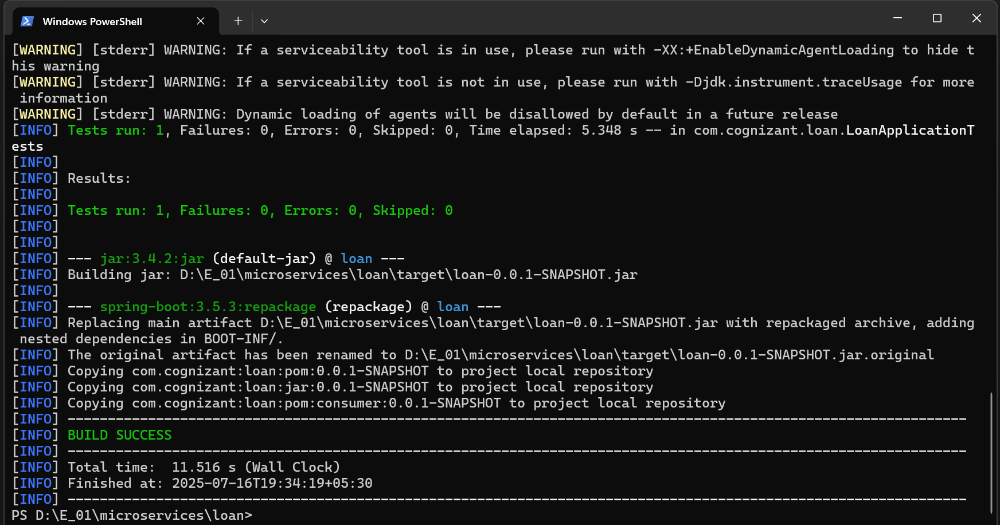
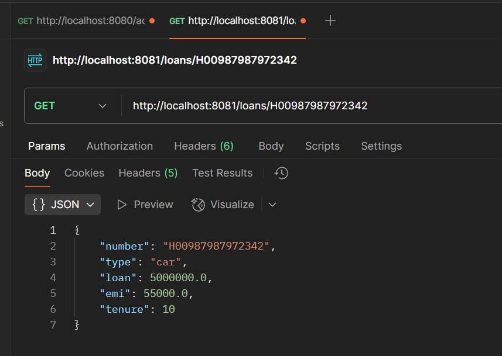

# ✅ Hands-on: Creating Microservices for Account and Loan

## 💡 Scenario

We are creating two independent Spring Boot microservices for a bank: one for managing **accounts** and one for managing **loans**.
Each service runs as a separate application with its own `pom.xml`, serving dummy JSON responses without backend connectivity.

## 🧩 Steps

### 1️⃣ Initial Setup

* Create a root folder: [`microservices`](./Code/E_01/microservices).

* Inside it, create two folders:

  * [`account`](./Code/E_01/microservices/account)
  * [`loan`](./Code/E_01/microservices/loan)

* Use [Spring Initializr](https://start.spring.io/):

  * **Group:** `com.cognizant`
  * **Artifact:** `account` or `loan`
  * Select:

    * Developer Tools > Spring Boot DevTools
    * Web > Spring Web

* Download, extract, and move to respective folders.

### 2️⃣ Build with Maven

* Open terminal in each service folder (`account` and `loan`).
* Run:

```bash
mvn clean package
```

### 3️⃣ Account Microservice

* **Folder:** [`account`](./Code/E_01/microservices/account)
* **Port:** Default (8080)
* **Endpoint:** `/accounts/{number}`
* **Application:** [`AccountApplication.java`](./Code/E_01/microservices/account/src/main/java/com/cognizant/account/AccountApplication.java)
* **Controller:** [`AccountController.java`](./Code/E_01/microservices/account/src/main/java/com/cognizant/account/AccountController.java)
* **Sample Response:**

```json
{
  "number": "00987987973432",
  "type": "savings",
  "balance": 650000
}
```

* Test in browser or Postman on port 8080.

### 4️⃣ Loan Microservice

* **Folder:** [`loan`](./Code/E_01/microservices/loan)

* **Port:** `8081` (configured via `server.port`)

* **Endpoint:** `/loans/{number}`

* **Application:** [`LoanApplication.java`](./Code/E_01/microservices/loan/src/main/java/com/cognizant/loan/LoanApplication.java)

* **Controller:** [`LoanController.java`](./Code/E_01/microservices/loan/src/main/java/com/cognizant/loan/LoanController.java)

* **Configuration:** [`application.properties`](./Code/E_01/microservices/loan/src/main/resources/application.properties)

* **Sample Response:**

```json
{
  "number": "H00987987972342",
  "type": "car",
  "loan": 5000000,
  "emi": 55000,
  "tenure": 10
}
```

* Launch after starting account service.
* Test on port 8081.

## 💻 Output Screenshots

### 🗂 File Structure



### ✅ Account Service

#### Server logs



#### Maven Clean



#### Postman Test



### ✅ Loan Service

#### Server logs



#### Maven Clean



#### Postman Test



## ✅ Summary

* You now have two microservices running independently on different ports.
* Each microservice handles its own domain and returns a simple JSON response.