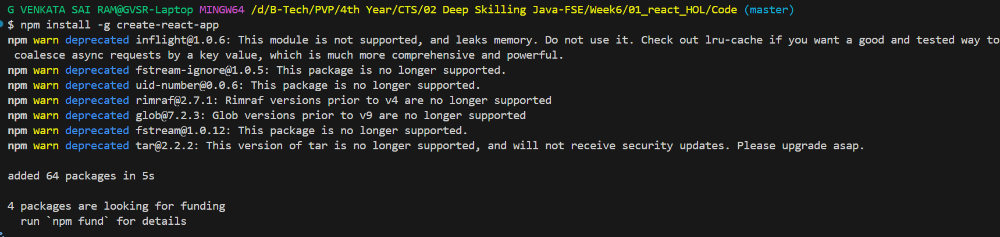
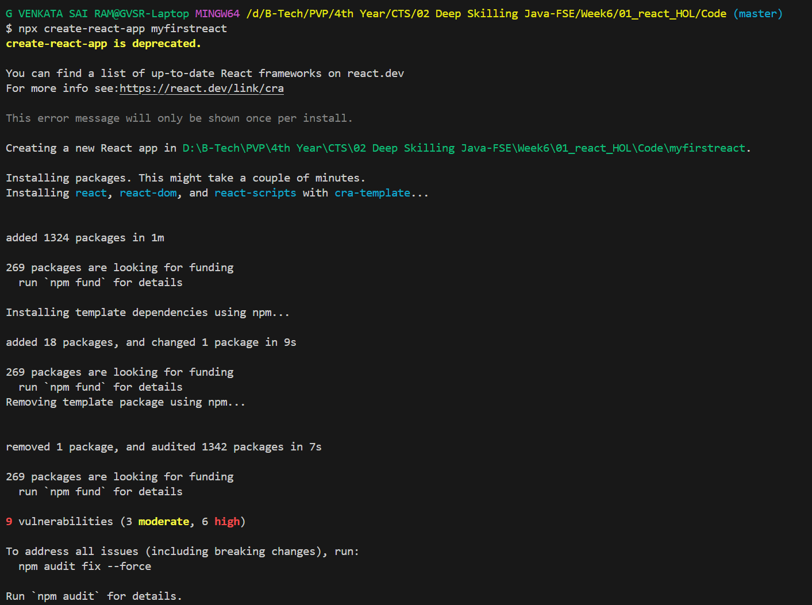
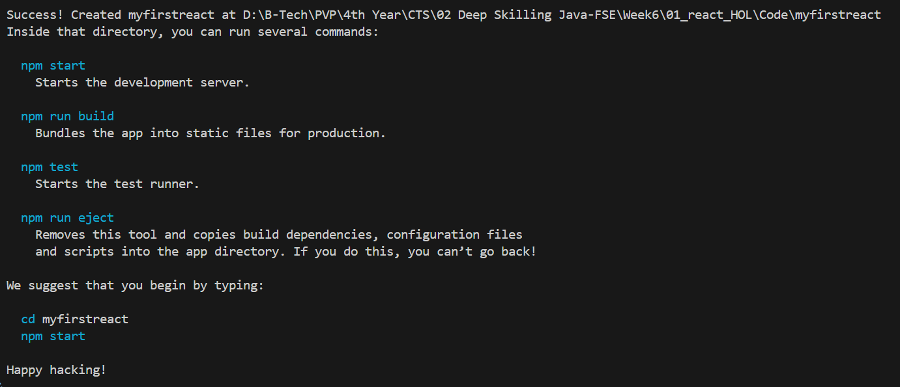
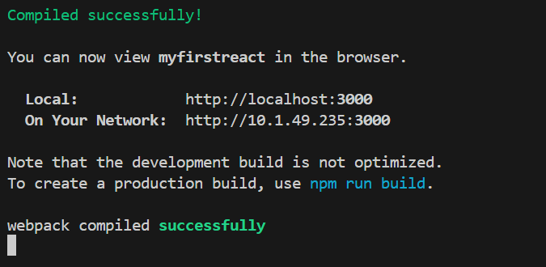
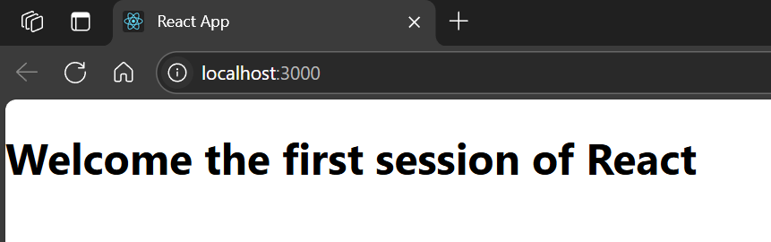

# Hands-on: 1. ReactJS HOL

## Scenario
Create a new React Application with the name “myfirstreact”, Run the application to print “welcome to the first session of React” as heading of that page.

## Steps
### 1️⃣ Initial Setup
* To create a new React app, we need to have Node.js and NPM Installed from the following link: [Node.js](https://nodejs.org/en/download/)

### 2️⃣ Create React App
* If the Create-react-app command is not available, install it globally using:
```bash
npm install -g create-react-app
```
* Create a new React application named `myfirstreact`:
```bash
npx create-react-app myfirstreact
```

### 3️⃣ Navigate to the Project Directory
* Change your working directory to the newly created project folder:
```bash
cd myfirstreact
```

### 4️⃣ Modify the App Component
* Open the [`src/App.js`](./Code/myfirstreact/src/App.js) file and modify the code to display the desired heading:
```jsx
function App() {
  return (
    <div className="App">
      <h1>welcome the first session of React</h1>
    </div>
  );
}
```

### 5️⃣ Run the Application
* Start the development server to run the application:
```bash
npm start
```

## Output
#### Installing create-react-app


#### Creating a new React app


#### Successfully created the app


#### Running the React app


#### Output of the React app


### Define SPA and its beniefits

#### Single Page Application (SPA)

A Single Page Application (SPA) is a web application that interacts with the user by dynamically rewriting the current page, rather than loading entire new pages from the server. This approach allows for a more fluid user experience, similar to a desktop application.

##### Benefits of SPA

1. **Improved Performance**: SPAs load a single HTML page and dynamically update content as needed, reducing the amount of data transferred and improving load times.
2. **Enhanced User Experience**: By avoiding full page reloads, SPAs provide a smoother and more responsive user experience.
3. **Easier Development**: SPAs often use modern JavaScript frameworks (like React, Angular, or Vue.js) that promote reusable components and a more organized code structure.
4. **Reduced Server Load**: Since SPAs handle much of the rendering on the client side, they can reduce the load on the server and improve scalability.

### Define React and identify its working
#### React
React is a popular JavaScript library for building user interfaces, particularly single-page applications where you need a fast, interactive user experience. It allows developers to create large web applications that can change data without reloading the page.
#### How React Works
React works by breaking down the user interface into reusable components. Each component manages its own state and can be composed to build complex UIs. When the state of a component changes, React efficiently updates and re-renders only the components that need to change, rather than the entire page.

### Difference between SPA and MPA
#### Single Page Application (SPA) vs. Multi-Page Application (MPA)
| Feature                | Single Page Application (SPA) | Multi-Page Application (MPA) |
|------------------------|-------------------------------|-------------------------------|
| Page Loading           | Loads a single HTML page and dynamically updates content | Loads a new HTML page for each interaction |
| User Experience        | Smooth, fast, and responsive with no full page reloads | Can be slower due to full page reloads |
| Development Complexity | Often simpler with reusable components | Can be more complex with multiple pages and server
| Server Load            | Reduced, as much rendering is done on the client side | Higher, as each page load requires server processing |

### Explain Pros and cons of SPA
#### Pros of Single Page Applications (SPAs)
1. **Fast Loading**: SPAs load once and dynamically update content, leading to faster interactions.
2. **Responsive User Experience**: SPAs provide a seamless experience without full page reloads
3. **Reduced Server Load**: SPAs handle much of the rendering on the client side, which can reduce server load and improve scalability.
4. **Easier State Management**: SPAs can manage state more easily with libraries like Redux or Context API, allowing for better data flow and management across components.
#### Cons of Single Page Applications (SPAs)
1. **SEO Challenges**: SPAs can be less SEO-friendly since content is loaded dynamically, making it harder for search engines to index.
2. **Initial Load Time**: The initial load can be slower as the entire application is loaded at once, including JavaScript and CSS.
3. **Browser History Management**: SPAs require careful management of browser history and navigation, which can be complex.

### Explain about React
React is a JavaScript library developed by Facebook for building user interfaces, particularly for single-page applications. It allows developers to create large web applications that can change data without reloading the page. React uses a component-based architecture, where each component manages its own state and can be reused across the application.

### Define Virtual DOM
#### Virtual DOM
The Virtual DOM is a lightweight copy of the actual DOM (Document Object Model) used by React to optimize rendering performance. When the state of a component changes, React updates the Virtual DOM first, then compares it with the actual DOM to determine the minimal set of changes needed. This process, known as "reconciliation," allows React to efficiently update the user interface without unnecessary re-renders, leading to better performance and a smoother user experience.

### Explain features of React
#### Features of React
1. **Component-Based Architecture**: React applications are built using reusable components, which encapsulate their own logic and rendering.
2. **Declarative UI**: React allows developers to describe what the UI should look like for a given state, making it easier to understand and debug.
3. **Unidirectional Data Flow**: Data flows in one direction, from parent to child components, making it easier to manage and debug.
4. **JSX Syntax**: React uses JSX, a syntax extension that allows developers to write HTML-like code within JavaScript, making it easier to visualize the UI structure.
