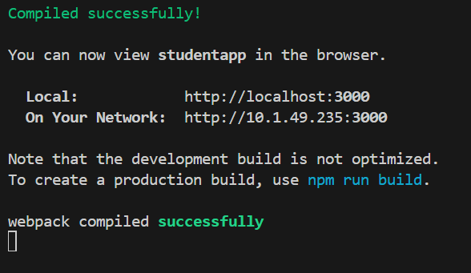
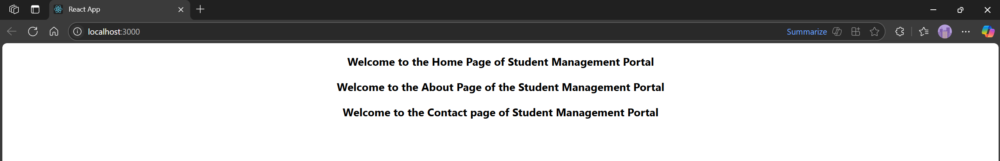

# Hands-on: 2. ReactJS HOL

## Scenario
Create a react app for Student Management Portal named StudentApp and create a component named Home which will display the Message “Welcome to the Home page of Student Management Portal”. Create another component named About and display the Message “Welcome to the About page of the Student Management Portal”. Create a third component named Contact and display the Message “Welcome to the Contact page of the Student Management Portal”. Call all the three components.

## Steps
### 1️⃣ Initial Setup
* Create a React project named “StudentApp” type the following command in terminal of Visual studio:
```bash
npx create-react-app StudentApp
```

### 2️⃣ Creating Home Component
* Create a new folder under Src folder with the name “Components”. Add a new file named “Home.js”
* Open the [`Home.js`](./Code/studentapp/src/Componants/Home.js) file and add the following code:
```jsx
import React,{Component} from 'react';

class Home extends Component {
    render(){   
        return (
            <div>
                <h3>Welcome to the Home Page of Student Management Portal</h3>
            </div>
        )
    }
}

export {Home};
```

### 3️⃣ Creating About Component
* In the same “Components” folder, create another file named “About.js”
* Open the [`About.js`](./Code/studentapp/src/Componants/About.js) file and add the following code:
```js
import React, { Component } from 'react';

class About extends Component {
    render() {
        return (
            <div>
                <h3>Welcome to the About Page of the Student Management Portal</h3>
            </div>
        );
    }
}

export {About};
```

### 4️⃣ Creating Contact Component
* In the same “Components” folder, create another file named “Contact.js”
* Open the [`Contact.js`](./Code/studentapp/src/Componants/Contact.js) file and add the following code:
```jsx
import React, {Component} from 'react';

class Contact extends Component {
    render(){
        return(
            <div>
                <h3>Welcome to the Contact page of Student Management Portal</h3>
            </div>
        )
    }
}

export {Contact};
```

### 5️⃣ Modifying App.js to Include Components
* Open the [`src/App.js`](./Code/studentapp/src/App.js) file and modify it to include the components created above:
```jsx
import './App.css';
import { Home } from './Componants/Home.js';
import { About } from './Componants/About.js';
import { Contact } from './Componants/Contact.js';

function App(){
  return(
    <div className='container'>
      <Home/>
      <About/>
      <Contact/>
    </div>
  )
}

export default App;
```

### 6️⃣ Running the Application
* Start the development server to run the application:
```bash
npm start
```
## Output
#### Creating a new React app


#### Output of the react app


### Explain React Components
React components are the building blocks of a React application. They allow developers to break down the UI into reusable pieces, making it easier to manage and maintain the code. Each component can have its own state and props, enabling dynamic rendering based on user interactions or data changes.
Components can be functional or class-based, with functional components being the preferred approach in modern React development. They can also be nested, allowing for complex UIs to be constructed from simple, isolated components. React's component-based architecture promotes reusability and separation of concerns, making it a powerful tool for building interactive user interfaces.

### Identify the difference between components and  Javascript functions
#### React Components
Components in React are special JavaScript functions or classes that return React elements, which describe what should appear on the screen. They can manage their own state and lifecycle methods, allowing for dynamic rendering and interaction with user inputs. Components can also accept props, which are inputs passed from parent components, enabling data flow and reusability.

#### JavaScript Functions
JavaScript functions are reusable blocks of code that perform a specific task. They can take parameters and return values, but they do not have the built-in capabilities of React components, such as managing state or lifecycle methods. Functions are typically used for calculations, data manipulation, or other logic that does not involve rendering UI elements.

### Identify the types of components in React
In React, there are primarily two types of components:
1. **Functional Components**: These are simple JavaScript functions that return React elements. They can accept props and are often used for presentational purposes. With the introduction of Hooks, functional components can also manage state and side effects, making them more powerful.
2. **Class Components**: These are ES6 classes that extend the `React.Component` class. They can have their own state and lifecycle methods, allowing for more complex behavior. Class components are less commonly used in modern React development due to the rise of functional components with Hooks.

### Define Component Constructor
In React, a component constructor is a special method that is called when an instance of a class component is created. It is used to initialize the component's state and bind methods to the component instance. The constructor is defined using the `constructor` keyword within a class that extends `React.Component`.

### Define render()
The `render()` method is a required method in class components that returns the JSX to be rendered on the screen. It is called whenever the component's state or props change, allowing React to update the UI accordingly. The `render()` method should be pure, meaning it should not cause side effects or modify the component's state directly.