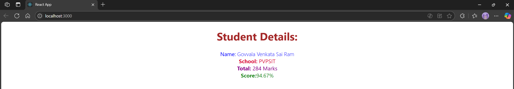

# Hands-on: 3. ReactJS HOL

## Scenario
Create a react app for Student Management Portal named scorecalculatorapp and create a function component named “CalculateScore” which will accept Name, School, Total and goal in order to calculate the average score of a student and display the same.

## Steps
### 1️⃣ Initial Setup
* Create a React project named “scorecalculatorapp” type the following command in terminal of Visual studio:
```bash
npx create-react-app scorecalculatorapp
```

### 2️⃣ Creating CalculateScore Component
* Create a new folder under Src folder with the name “Components”. Add a new file named
“CalculateScore.js”
* Open the [`CalculateScore.js`](./Code/scorecalculatorapp/src/Components/CalculatorScore.js) file and add the following code:
```jsx
import '../Stylesheets/mystyle.css';

const percentToDecimal = (decimal) => {
    return (decimal.toFixed(2) + '%');
}

const calcScore = (total, goal) => {
    return percentToDecimal(total / goal);
}

export const CalculateScore = ({ Name, School, total, goal }) => (
    <div className="formatstyle">
        <h1><font color="Brown">Student Details:</font></h1>

        <div className="Name">
            <b><span> Name: </span></b>
            <span>{Name}</span>
        </div>

        <div className="School">
            <b><span> School: </span></b>
            <span>{School}</span>
        </div>

        <div className="Total">
            <b><span>Total: </span></b>
            <span>{total}</span>
            <span> Marks</span>
        </div>

        <div className="Score">
            <b>Score:</b>
            <span>
                {calcScore(total, goal)}
            </span>
        </div>
    </div>
);
```

### 3️⃣ Styling the Component
* Create a new folder under Src folder with the name “Stylesheets”. Add a new file
named “mystyle.css”
* Open the [`mystyle.css`](./Code/scorecalculatorapp/src/Stylesheets/mystyle.css) file and add the following code:
```css
.Name {
    font-weight: 300;
    color: blue;
}

.School {
    color: crimson;
}

.Total {
    color: darkmagenta;
}

.formatstyle {
    text-align: center;
    font-size: large;
}

.Score {
    color: forestgreen;
}
```
### 4️⃣ Using the CalculateScore Component
* Open the [`App.js`](./Code/scorecalculatorapp/src/App.js) file and modify it to use the `CalculateScore` component:
```jsx
import { CalculateScore } from './Components/CalculatorScore.js';

function App() {
    return (
        <div>
            <CalculateScore 
                Name={"Govvala Venkata Sai Ram"} 
                School={"PVPSIT"} 
                total={284} 
                goal={3} 
            />
        </div>
    );
}

export default App;
```
### 5️⃣ Running the Application
* Open the terminal in Visual Studio Code and navigate to the `scorecalculatorapp` directory.
* Run the following command to start the application:
```bash
npm start
```

## Output



#### React Notes
[`React Notes`](../02_react_HOL/README.md) - This file contains additional notes and resources related to React.