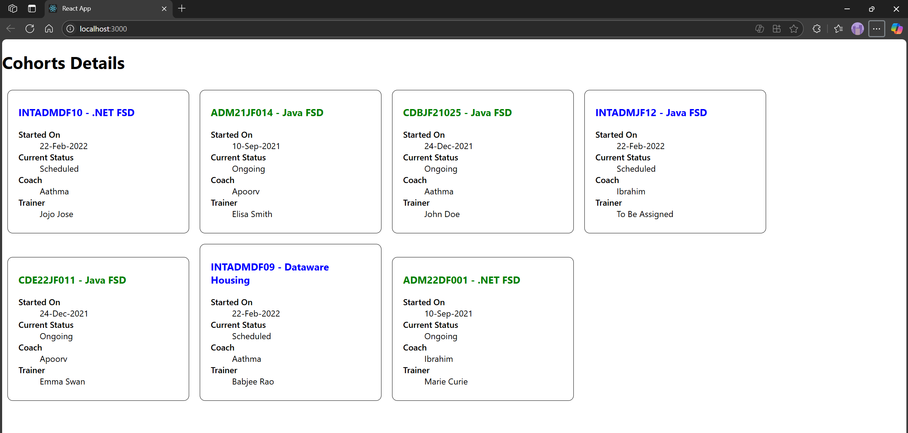

# Hands-on: 5. ReactJS HOL

## Objectives
* Understanding the need for styling react component
* Working with CSS Module and inline styles

## Steps
### 1️⃣ Initial Setup
* Create a React project named “cohorttracker” type the following command in terminal of Visual studio:
```bash
npx create-react-app cohorttracker
```

### 2️⃣ Creating CohortDetails Component
* Create a new file under `src` folder with the name `CohortDetails.js`
* Open the [`CohortDetails.js`](./Code/cohorttracker/src/CohortDetails.js) file and add the following code:
```jsx
import styles from './CohortDetails.module.css';

function CohortDetails(props) {
    return (
        <div className={styles.box}>
            <h3 style={{ color: props.cohort.currentStatus.toLowerCase() === 'ongoing' ? 'green' : 'blue' }}>
                {props.cohort.cohortCode} - <span>{props.cohort.technology}</span>
            </h3>
            <dl>
                <dt>Started On</dt>
                <dd>{props.cohort.startDate}</dd>
                <dt>Current Status</dt>
                <dd>{props.cohort.currentStatus}</dd>
                <dt>Coach</dt>
                <dd>{props.cohort.coachName}</dd>
                <dt>Trainer</dt>
                <dd>{props.cohort.trainerName}</dd>
            </dl>
        </div>
    );
}

export default CohortDetails;
```

### 3️⃣ Creating CohortDetails CSS Module
* Create a new file under `src` folder with the name `CohortDetails.module.css`
* Open the [`CohortDetails.module.css`](./Code/cohorttracker/src/CohortDetails.module.css) file and add the following code:
```css
.box {
  width: 300px;
  display: inline-block;
  margin: 10px;
  padding: 10px 20px;
  border: 1px solid black;
  border-radius: 10px;
}

dt {
  font-weight: 500;
}
```

## Output


