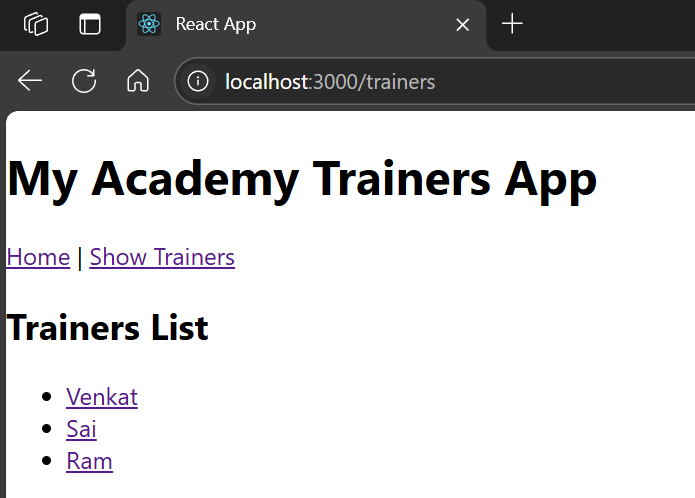

# Hands-on: 6. ReactJS HOL

## Scenario
Cognizant Academy teams want to maintain a list of trainers along with their expertise in a SPA using React as the technology. You are assigned the task of creating this React app. 
The following trainers’ data application will deal.
1.	T-ID
2.	Name
3.	Phone
4.	Email
5.	Stream
6.	Skills

## Steps

### 1️⃣ Initial Setup
* Create a React project named “trainerapp” type the following command in terminal of Visual studio:
```bash
npx create-react-app trainerapp
```

### 2️⃣ Creating Trainer Class
* Create a new file under Src folder with the name “Trainer.js”
* Open the [`Trainer.js`](./Code/trainersapp/src/Components/Trainer.js) file and add the following code:
```jsx
class Trainer {
  constructor(id, name, email, mobile, primarySkill, skills) {
    this.id = id;
    this.name = name;
    this.email = email;
    this.mobile = mobile;
    this.primarySkill = primarySkill;
    this.skills = skills;
  }
}

export default Trainer;
```

### 3️⃣ Creating Trainer Mock Data
* Create a new file under Src folder with the name “TrainerMock.js”
* Open the [`TrainerMock.js`](./Code/trainersapp/src/Components/TrainerMock.js) file and add the following code:
```jsx
import Trainer from "./Trainer.js";

const trainersMock = [
  new Trainer('t-venkat',
    'Venkat',
    'venkat@example.com',
    '9000000001',
    'Java',
    ['Java', 'Spring', 'Hibernate']),

  new Trainer('t-sai',
    'Sai',
    'sai@example.com',
    '9000000002',
    'Python',
    ['Python', 'Django', 'Flask']),

  new Trainer('t-ram',
    'Ram',
    'ram@example.com',
    '9000000003',
    'JavaScript',
    ['JavaScript', 'React', 'Node.js'])
];

export default trainersMock;
```

### 4️⃣ Creating Trainer Details Component
* Create a new folder under Src folder with the name “Components”
* Create a new file under Components folder with the name “TrainerDetails.js”
* Open the [`TrainerDetails.js`](./Code/trainersapp/src/Components/TrainerDetails.js) file and add the following code:
```jsx
import React from 'react';
import { useParams } from 'react-router-dom';
import trainersMock from './TrainerMock.js';

const TrainerDetails = () => {
  const { id } = useParams();
  const trainer = trainersMock.find(t => t.id === id);

  return (
    <div>
      <h2>Trainers Details</h2>
      <p><b>{trainer.name} ({trainer.primarySkill})</b></p>
      <p>{trainer.email}</p>
      <p>{trainer.mobile}</p>
      <ul>
        {trainer.skills.map((skill, index) => (
          <li key={index}>{skill}</li>
        ))}
      </ul>
    </div>
  );
};

export default TrainerDetails;
```

### 5️⃣ Creating Trainer List Component
* Create a new file under Components folder with the name “TrainerList.js”
* Open the [`TrainerList.js`](./Code/trainersapp/src/Components/Trainerlist.js) file and add the following code:
```jsx
import React from 'react';
import { Link } from 'react-router-dom';

const TrainersList = ({ trainers }) => {
  return (
    <div>
      <h2>Trainers List</h2>
      <ul>
        {trainers.map(trainer => (
          <li key={trainer.id}>
            <Link to={`/trainer/${trainer.id}`}>{trainer.name}</Link>
          </li>
        ))}
      </ul>
    </div>
  );
};

export default TrainersList;
```

### 6️⃣ Creating Home Component
* Create a new file under Components folder with the name “Home.js”
* Open the [`Home.js`](./Code/trainersapp/src/Components/Home.js) file
and add the following code:
```jsx
import React from 'react';

function Home(){
    return(
        <div>
            <h1>Welcome to My Academy trainers page</h1>
        </div>
    )
}

export default Home;
```

### 7️⃣ Creating App Component
* Open the [`App.js`](./Code/trainersapp/src/App.js) file and modify it as follows:
```jsx
import React from 'react';
import { BrowserRouter, Routes, Route, Link } from 'react-router-dom';
import Home from './Components/Home.js';
import TrainersList from './Components/Trainerlist.js';
import TrainerDetails from './Components/TrainerDetails.js';
import trainersMock from './Components/TrainerMock.js';

function App() {
  return (
    <BrowserRouter>
      <div>
        <h1>My Academy Trainers App</h1>
        <nav>
          <Link to="/">Home</Link> | <Link to="/trainers">Show Trainers</Link>
        </nav>

        <Routes>
          <Route path="/" element={<Home />} />
          <Route path="/trainers" element={<TrainersList trainers={trainersMock} />} />
          <Route path="/trainer/:id" element={<TrainerDetails />} />
        </Routes>
      </div>
    </BrowserRouter>
  );
}

export default App;
```

### 8️⃣ Running the Application
* Open the terminal in Visual Studio Code and navigate to the project directory.
* Run the following command to start the application:
```bash
npm start
```
## Output
#### Home Page

#### Trainers List and Details

#### Trainer Details
###### Venkat

###### Sai

###### Ram


### Explain the need and Benifits of React Router
React Router is essential for building single-page applications (SPAs) in React. It allows developers to create a seamless navigation experience without reloading the entire page. The benefits include:
1. **Dynamic Routing**: React Router enables dynamic routing, allowing developers to define routes based on application state or user interactions.
2. **Nested Routes**: It supports nested routes, enabling complex UI structures and better organization of components.
3. **Declarative Routing**: Routes are defined declaratively, making it easier to understand and maintain the routing logic.
4. **Code Splitting**: React Router supports code splitting, which helps in loading only the necessary components for a specific route, improving performance.

### Components of React Router
1. **BrowserRouter**: The main component that keeps the UI in sync with the URL and enables client-side routing.
2. **Routes**: A component that renders the first child `<Route>` that matches the current location.
3. **Route**: Defines a mapping between a URL path and a component to render when the path matches.
4. **Link**: A component that allows navigation to different routes without reloading the page.
5. **useParams**: A hook that returns an object of key/value pairs of URL parameters, allowing access to dynamic segments of the URL.

### List the types of router components
1. **BrowserRouter**: Uses the HTML5 history API to keep the UI in sync with the URL.
2. **HashRouter**: Uses the hash portion of the URL (window.location.hash) to keep the UI in sync with the URL, suitable for static file servers.
3. **MemoryRouter**: Keeps the history of your "URL" in memory (does not read or write to the address bar), useful for testing and non-browser environments.

### Parameter passing via url
In React Router, parameters can be passed via the URL using the `:paramName` syntax in the route path. For example, in the route definition:
```jsx
<Route path="/trainer/:id" element={<TrainerDetails />} />
```
The `:id` part is a URL parameter that can be accessed in the component using the `useParams` hook. This allows you to retrieve dynamic values from the URL, such as trainer IDs, and use them to fetch or display specific data.