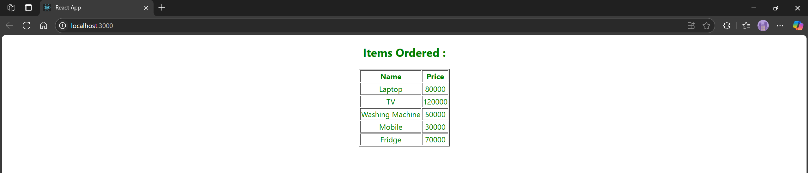

# Hands-on: 7. ReactJS HOL

## Scenario
Create a React Application named “shoppingapp” with a class component named “OnlineShopping” and “Cart”.

## Steps

### 1️⃣ Initial Setup
* Create a React project named “shoppingapp” by typing the following command in the terminal of Visual Studio:
```bash
npx create-react-app shoppingapp
```

### 2️⃣ Creating OnlineShopping Class
* Navigate to the `src/Components` directory and create a file named [`OnlineShopping.js`](./Code/shoppingapp/src/Components/OnlineShopping.js)
```javascript
import React, { Component } from 'react';
import Cart from './Cart';

class OnlineShopping extends Component {
    constructor(props) {
        super(props);

        this.items = [
            new Cart("Laptop", 80000),
            new Cart("TV", 120000),
            new Cart("Washing Machine", 50000),
            new Cart("Mobile", 30000),
            new Cart("Fridge", 70000)
        ];
    }

    render() {
        return (
            <div style={{ textAlign: 'center' }}>
                <h2 style={{ color: 'green' }}>Items Ordered :</h2>
                <table border="1" align="center" style={{ color: 'green' }}>
                    <thead>
                        <tr>
                            <th>Name</th>
                            <th>Price</th>
                        </tr>
                    </thead>
                    <tbody>
                        {this.items.map((item, index) => (
                            <tr key={index}>
                                <td>{item.itemname}</td>
                                <td>{item.price}</td>
                            </tr>
                        ))}
                    </tbody>
                </table>
            </div>
        );
    }
}

export default OnlineShopping;
```

### 3️⃣ Creating Cart Class
* In the same directory, create a file named [`Cart.js`](./Code/shoppingapp/src/Components/Cart.js):
```javascript
class Cart {
    constructor(itemname, price) {
        this.itemname = itemname;
        this.price = price;
    }
}

export default Cart;
```

### 4️⃣ Integrating OnlineShopping in App Component
* Open `src/App.js` and modify it to include the `OnlineShopping` component in [`App.js`](./Code/shoppingapp/src/App.js):
```javascript
import React from 'react';
import OnlineShopping from './Components/OnlineShopping.js';

function App() {
  return (
    <div>
      <OnlineShopping />
    </div>
  );
}

export default App;
```

### 5️⃣ Running the Application
* Open the terminal in Visual Studio Code and navigate to the `shoppingapp` directory.
* Run the following command to start the application:
```bash
npm start
```

## Output


### Define what are Props
Props (short for "properties") are a mechanism in React that allows you to pass data from one component to another, typically from a parent component to a child component. They are read-only and help in making components reusable by allowing them to receive dynamic data. Props can be any type of data, including strings, numbers, arrays, objects, or even functions.

### Explain Default Props
Default props are a feature in React that allows you to define default values for props in a component. If a parent component does not provide a value for a specific prop, the component will use the default value instead. This is useful for ensuring that components have predictable behavior and can handle cases where certain props are not provided.

### Identify the difference between Props and State
Props and state are both used to manage data in React, but they serve different purposes:
- **Props**:
    - Are used to pass data from a parent component to a child component.
    - Are read-only and cannot be modified by the child component.
    - Help in making components reusable and dynamic.
- **State**:
    - Is used to manage data that can change within a component.
    - Is mutable and can be updated using the `setState` method.
    - Allows components to respond to user interactions and other events.

### Explain reactDOM.render()
`reactDOM.render()` is a method provided by the ReactDOM library that is used to render a React component into the DOM. It takes two arguments: the React element (or component) to be rendered and the DOM node where it should be rendered. This method is typically called in the entry point of a React application (usually `index.js`) to mount the root component of the application onto a specific HTML element, such as a `<div>` with an `id` of "root".
```javascript
import React from 'react';
import ReactDOM from 'react-dom';
import App from './App';
ReactDOM.render(
  <React.StrictMode>
    <App />
  </React.StrictMode>,
  document.getElementById('root')
);
```