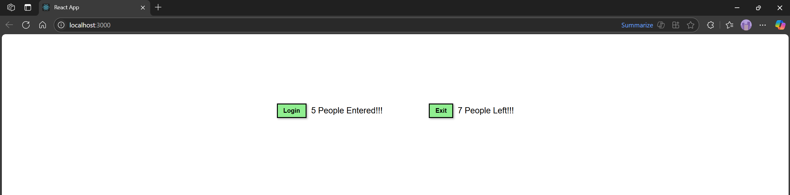

# Hands-on: 8. ReactJS HOL

## Scenario
Create a React App “counterapp” which will have a component named “CountPeople” which will have 2 methods.

UpdateEntry()   which will display the number of people who entered the mall.
UpdateExit()  which will display the number of people who exited the mall.

Use Constructor and state to Store the entrycount and exitcount.

The component has 2 buttons
1.	Login  when clicked, the entrycount should get incremented by 1
2.	Exit  when clicked, the exitcount should get incremented by 1

## Steps

### 1️⃣ Initial Setup
* Create a React project named “counterapp” by typing the following command in the terminal of
Visual Studio:
```bash
npx create-react-app counterapp
```

### 2️⃣ Creating CountPeople Class
* Navigate to the `src/Components` directory and create a file named [`CountPeople.js`](./Code/counterapp/src/CountPeople.js).
* In this file, create a class `CountPeople` that extends `React.Component`.
```javascript
import React, { Component } from 'react';
import './App.css'; 

class CountPeople extends Component {
  constructor() {
    super();
    this.state = {
      entrycount: 0,
      exitcount: 0
    };
  }

  updateEntry() {
    this.setState((prevState) => ({
      entrycount: prevState.entrycount + 1
    }));
  }

  updateExit() {
    this.setState((prevState) => ({
      exitcount: prevState.exitcount + 1
    }));
  }

  render() {
    return (
      <div className="container">
        <div className="counter-box">
          <button onClick={() => this.updateEntry()}>Login</button>
          {this.state.entrycount} People Entered!!!
        </div>

        <div className="counter-box">
          <button onClick={() => this.updateExit()}>Exit</button>
          {this.state.exitcount} People Left!!!
        </div>
      </div>
    );
  }
}

export default CountPeople;
```

### 3️⃣ Integrating CountPeople in App.js
* Open the [`App.js`](./Code/counterapp/src/App.js) file in the `src` directory.
* Import the `CountPeople` component and use it within the `App` component's render method.
```javascript
import React from 'react';
import CountPeople from './CountPeople.js';
import './App.css'

function App() {
  return (
    <div>
      <CountPeople />
    </div>
  );
}

export default App;
```

### 4️⃣ Some Styling
* Create a CSS file named [`App.css`](./Code/counterapp/src/App.css) in the `src` directory and add
```css
.container {
  display: flex;
  justify-content: center;
  align-items: center;
  margin-top: 150px;
  gap: 100px;
}

.counter-box {
  display: flex;
  align-items: center;
  gap: 10px;
  font-size: 18px;
  font-family: Arial, sans-serif;
}

button {
  background-color: lightgreen;
  border: 2px solid black;
  padding: 6px 12px;
  cursor: pointer;
  box-shadow: 2px 2px 4px rgba(0, 0, 0, 0.3); /* slight raised effect */
  font-weight: bold;
}
```

### 5️⃣ Running the Application
* Open the terminal in Visual Studio Code and navigate to the `counterapp` directory.
* Run the application using the command:
```bash
npm start
```

## Output


### Explain React State
React state is an object that holds the dynamic data of a component. It allows components to create and manage their own data, which can change over time. When the state changes, React re-renders the component to reflect the new state.
State is initialized in the constructor of a class component and can be updated using the `setState ` method. This triggers a re-render of the component, allowing the UI to reflect the latest data.