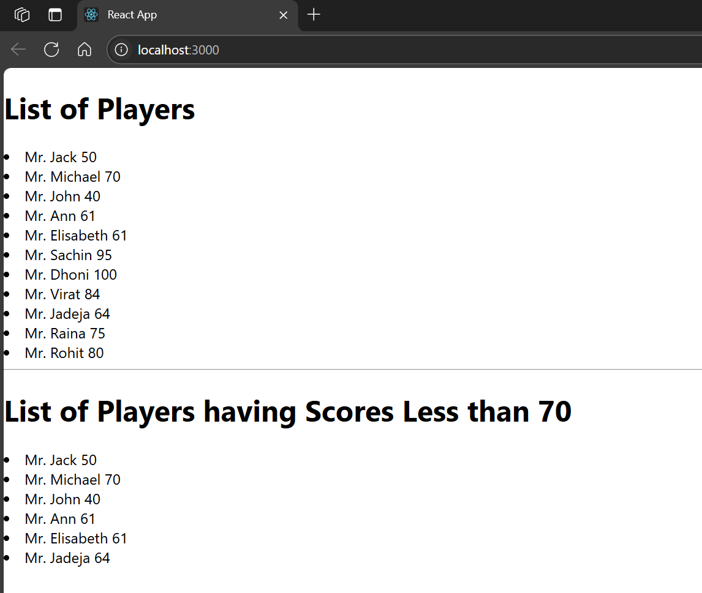
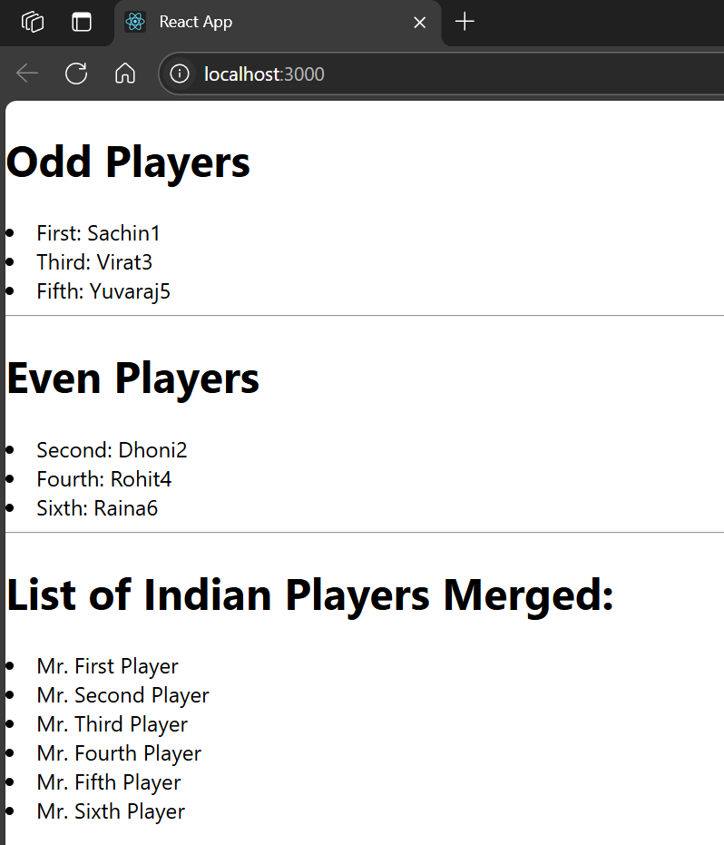

# Hands-on: 9. ReactJS HOL

## Scenario
Creating a react app named "cricketapp" which will have a component ListofPlayers that will display a list of players with their details and IndianPlayers that will display only Indian players.

### Steps

### 1️⃣ Initial Setup
* Create a React project named “cricketapp” by typing the following command in the terminal of Visual Studio:
```bash
npx create-react-app cricketapp
```
### 2️⃣ Creating ListofPlayers Component
* Navigate to the `src/Components` directory and create a file named [`ListofPlayers.js`](./Code/cricketapp/src/Components/ListofPlayers.js).
* In this file, create a class `ListofPlayers` that extends `React.Component`.
```javascript
import React from 'react';

const ListofPlayers = ({ players }) => {
  const below70 = players.filter(p => p.score <= 70);

  return (
    <div>
      <h1>List of Players</h1>
      {players.map((p, i) => (
        <li key={i}>Mr. {p.name} <span>{p.score}</span></li>
      ))}
      <hr />
      <h1>List of Players having Scores Less than 70</h1>
      {below70.map((p, i) => (
        <li key={i}>Mr. {p.name} <span>{p.score}</span></li>
      ))}
    </div>
  );
};

export default ListofPlayers;
```

### 3️⃣ Creating IndianPlayers Component
* Create another file named [`IndianPlayers.js`](./Code/cricketapp/src/Components/IndianPlayers.js) in the `src/Components` directory.
```javascript
import React from 'react';

const IndianPlayers = () => {
  const IndianTeam = ['Sachin1', 'Dhoni2', 'Virat3', 'Rohit4', 'Yuvaraj5', 'Raina6'];
  const [first,, third,, fifth] = IndianTeam;
  const [, second,, fourth,, sixth] = IndianTeam;

  const T20Players = ['First Player', 'Second Player', 'Third Player'];
  const RanjiTrophyPlayers = ['Fourth Player', 'Fifth Player', 'Sixth Player'];
  const mergedPlayers = [...T20Players, ...RanjiTrophyPlayers];

  return (
    <div>
      <h1>Odd Players</h1>
      <li>First: {first}</li>
      <li>Third: {third}</li>
      <li>Fifth: {fifth}</li>

      <hr />
      <h1>Even Players</h1>
      <li>Second: {second}</li>
      <li>Fourth: {fourth}</li>
      <li>Sixth: {sixth}</li>

      <hr />
      <h1>List of Indian Players Merged:</h1>
      {mergedPlayers.map((p, i) => (
        <li key={i}>Mr. {p}</li>
      ))}
    </div>
  );
};

export default IndianPlayers;
```

### 4️⃣ Integrating Components in App.js
* Open the [`App.js`](./Code/cricketapp/src/App.js) file in the `src` directory.
* Import the `ListofPlayers` and `IndianPlayers` components and use them within the `App` component's render method.
* Set a flag to toggle between displaying the `ListofPlayers` and `IndianPlayers` components.
```javascript
import React from 'react';
import ListofPlayers from './Components/ListofPlayers.js';
import IndianPlayers from './Components/IndianPlayers.js';

function App() {
  const flag = false;

  const players = [
    { name: 'Jack', score: 50 },
    { name: 'Michael', score: 70 },
    { name: 'John', score: 40 },
    { name: 'Ann', score: 61 },
    { name: 'Elisabeth', score: 61 },
    { name: 'Sachin', score: 95 },
    { name: 'Dhoni', score: 100 },
    { name: 'Virat', score: 84 },
    { name: 'Jadeja', score: 64 },
    { name: 'Raina', score: 75 },
    { name: 'Rohit', score: 80 }
  ];

  return (
    <div className="App">
      {flag ? <ListofPlayers players={players} /> : <IndianPlayers />}
    </div>
  );
}

export default App;
```

## Output
#### List of Players

#### Indian Players


#### List features of ES6
* Arrow Functions
* Classes
* Template Literals
* Destructuring
* Default Parameters
* Modules
* Spread and Rest Operators
* Promises
#### Explain Javascript let
* `let` is a block-scoped variable declaration introduced in ES6.
* It allows you to declare variables that are limited in scope to the block, statement, or expression where they are used.
#### Identify Difference between var and let
* **Scope**: 
  - `var` is function-scoped, meaning it is accessible within the function it is declared in.
  - `let` is block-scoped, meaning it is only accessible within the block it is defined in (e.g., inside `{}`).
* **Hoisting**:
  - `var` declarations are hoisted to the top of their scope, meaning they can be used before they are declared.
  - `let` declarations are also hoisted, but they cannot be accessed before their declaration due to the "temporal dead zone".
#### Explain javascript const
* `const` is a block-scoped variable declaration introduced in ES6.
* It is used to declare variables whose values cannot be reassigned after their initial assignment.
* However, if the variable is an object or array, its properties or elements can still be modified.
#### Explain ES6 class fundementals
* ES6 classes are syntactical sugar over JavaScript's existing prototype-based inheritance.
* They provide a clearer and more concise way to create objects and handle inheritance.
* Classes can have a constructor method for initializing object properties.
* Methods can be defined within the class body, and they are automatically added to the prototype of the class.
#### Explain ES6 arrow function
* Arrow functions are a concise way to write function expressions in JavaScript.
* They do not have their own `this` context, which means they inherit `this` from the parent scope.
* They are defined using the `=>` syntax, which makes them shorter and often easier to read.
#### Identify set(), map()
* **Set**:
  - A Set is a collection of unique values. It can store any type of value, whether primitive or object.
  - Sets do not allow duplicate values and are useful for storing unique items.
  - Example: `const mySet = new Set([1, 2, 3, 3]); // mySet will contain 1, 2, 3`
* **Map**:
  - A Map is a collection of key-value pairs where keys can be of any type, and values can also be of any type.
  - Maps maintain the insertion order of keys and allow for efficient retrieval of values based on their keys.
  - Example: `const myMap = new Map(); myMap.set('key1', 'value1'); myMap.set('key2', 'value2');`       
