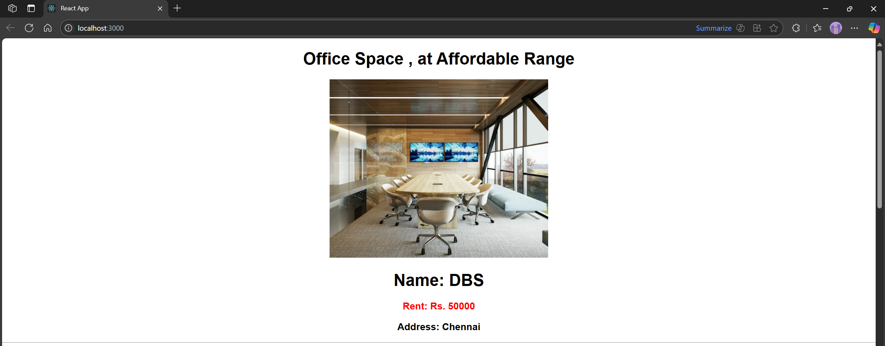
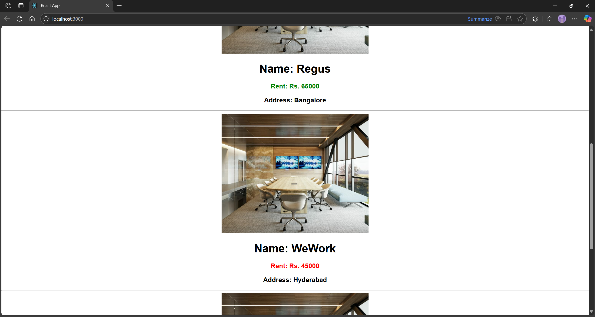

# Hands-on: 10. ReactJS HOL

## Scenario
Create a React Application named “officespacerentalapp” which uses React JSX to create elements, attributes and renders DOM to display the page.

Create an element to display the heading of the page.
Attribute to display the image of the office space
Create an object of office to display the details like Name, Rent and Address.
Create a list of Object and loop through the office space item to display more data.
To apply Css, Display the color of the Rent in Red if it’s below 60000 and in Green if it’s above 60000.

## Steps
### 1️⃣ Initial Setup
* Create a React project named “officespacerentalapp” by typing the following command in the terminal of Visual Studio:
```bash
npx create-react-app officespacerentalapp
```
### 2️⃣ Editing App.js
* Open the `src/App.js` file and replace its content with the following code:
```javascript
import React from 'react';
import './App.css';
import img1 from './images/office1.jpg'; // Use any image path

function App() {
  const heading = "Office Space";

  // List of Office Objects
  const officeList = [
    { Name: "DBS", Rent: 50000, Address: "Chennai", img: img1 },
    { Name: "Regus", Rent: 65000, Address: "Bangalore", img: img1 },
    { Name: "WeWork", Rent: 45000, Address: "Hyderabad", img: img1 },
    { Name: "SmartWorks", Rent: 70000, Address: "Mumbai", img: img1 }
  ];

  return (
    <div>
      <h1>{heading} , at Affordable Range</h1>
      {officeList.map((item, index) => {
        const colorClass = item.Rent <= 60000 ? 'textRed' : 'textGreen';

        return (
          <div key={index}>
            
            <h1>Name: {item.Name}</h1>
            <h3 className={colorClass}>Rent: Rs. {item.Rent}</h3>
            <h3>Address: {item.Address}</h3>
            <hr />
          </div>
        );
      })}
    </div>
  );
}

export default App;
```

### 3️⃣ Adding CSS
* Open the `src/App.css` file and add the following CSS styles:
```css
.textRed {
  color: red;
  font-weight: bold;
}

.textGreen {
  color: green;
  font-weight: bold;
}

body {
  font-family: Arial, sans-serif;
  text-align: center;
}
```

## Output




#### Define JSX
JSX (JavaScript XML) is a syntax extension for JavaScript that allows developers to write HTML-like code within JavaScript files. It is commonly used with React to describe what the UI should look like. JSX makes it easier to visualize the structure of the UI and allows for a more declarative approach to building components.

#### Explain about ECMA Script
ECMAScript (often abbreviated as ES) is a scripting language specification that serves as the foundation for JavaScript. It defines the syntax, semantics, and behavior of the language. ECMAScript is standardized by ECMA International and has undergone several revisions, with each version introducing new features and improvements. The most widely used versions include ES5, ES6 (also known as ES2015), and subsequent annual updates like ES2016, ES2017, etc. These updates have introduced features such as arrow functions, classes, modules, async/await, and more, enhancing the capabilities of JavaScript.

#### Explain React.createElement()
`React.createElement()` is a method provided by React that allows you to create React elements programmatically. It takes three arguments: the type of the element (which can be a string for HTML elements or a React component), an object containing the properties (props) for the element, and any children elements or text content. This method is used internally by JSX to create elements, but it can also be used directly in JavaScript code to create React components without JSX syntax.
```javascript
const element = React.createElement(
  'div',
  { className: 'my-class' },
  'Hello, World!'
);
```

#### Explain how to create React nodes with JSX
In JSX, React nodes can be created by writing HTML-like syntax directly within JavaScript code. JSX allows you to define elements and components in a more readable and declarative way. Here's how you can create React nodes with JSX:
```javascript
import React from 'react';
function MyComponent() {
  return (
    <div className="my-class">
      <h1>Hello, World!</h1>
        <p>This is a paragraph.</p>
    </div>
    );
}
export default MyComponent;
```
#### Define how to render JSX to DOM
To render JSX to the DOM, you typically use the `ReactDOM.render()` method. This method takes two arguments: the JSX element you want to render and the DOM element where you want to render it. Here's an example:
```javascript
import React from 'react';
import ReactDOM from 'react-dom';
import MyComponent from './MyComponent';
ReactDOM.render(
  <MyComponent />,
  document.getElementById('root')
);
```

#### Explain how to use JavaScript expressions in JSX
In JSX, you can use JavaScript expressions by wrapping them in curly braces `{}`. This allows you to embed dynamic values, variables, or expressions directly within the JSX code. For example:
```javascript
import React from 'react';
function Greeting({ name }) {
  return <h1>Hello, {name}!</h1>;
}
export default Greeting;
```

#### Explain how to use inline CSS in JSX
In JSX, you can use inline CSS by passing a JavaScript object to the `style` attribute. The keys of the object are camelCased versions of the CSS properties, and the values are the corresponding CSS values. Here's an example:
```javascript
import React from 'react';
function StyledComponent() {
    const style = {
        color: 'blue',
        fontSize: '20px',
        backgroundColor: 'lightgray'
    };
    
    return <div style={style}>This is a styled component!</div>;
    }
export default StyledComponent;
```