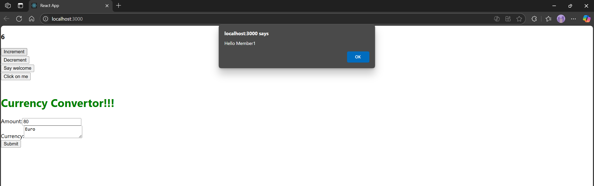
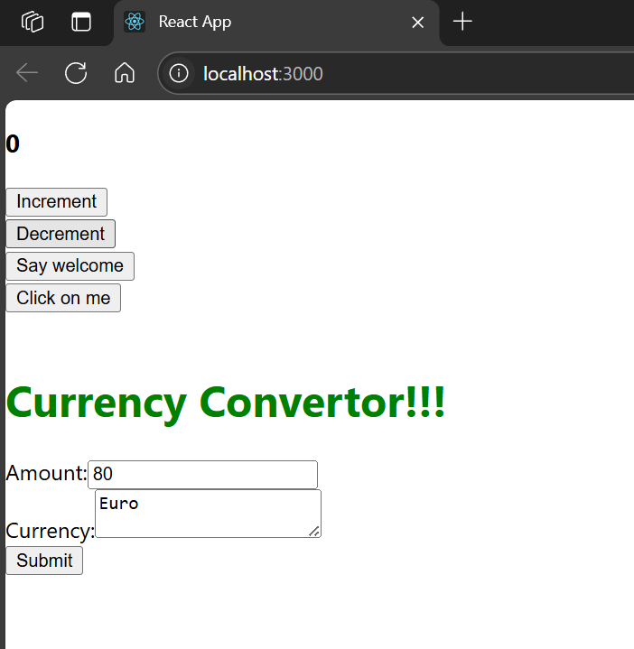
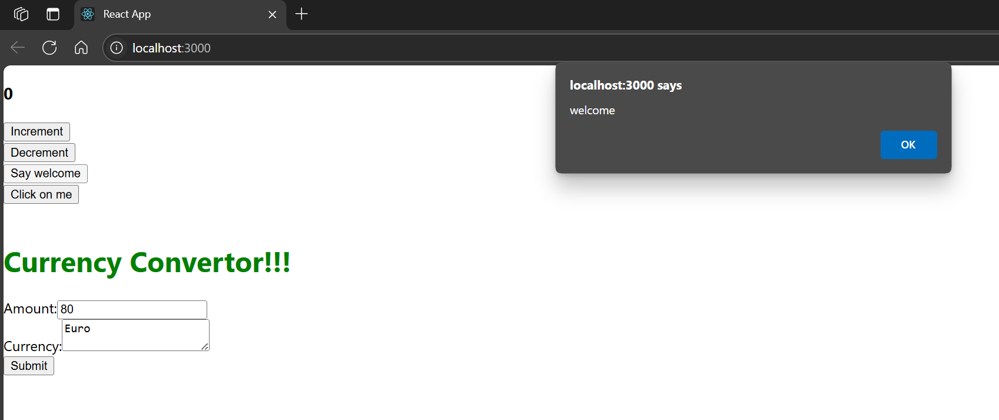
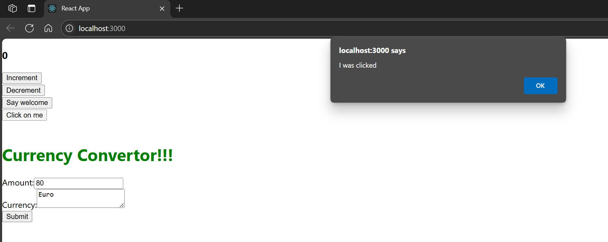
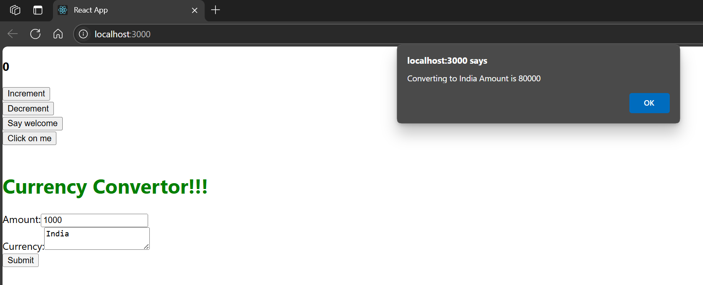

# Hands-on: 11. ReactJS HOL

## Scenario
Create a React Application “eventexamplesapp” to handle various events of the form elements in HTML.

## Steps
### 1️⃣ Initial Setup
* Create a React project named “eventexamplesapp” by typing the following command in the terminal of Visual Studio:
```bash
npx create-react-app eventexamplesapp
```

### 2️⃣ Editing App.js
* Open the [`src/App.js`](./Code/eventexamplesapp/src/App.js) file and replace its content with the following code:
```javascript
import React, { useState } from 'react';
import CurrencyConvertor from './Components/CurrencyConverter';

function App() {
  const [count, setCount] = useState(5);

  const handleIncrement = () => {
    setCount(count + 1);
    sayHello();
  };

  const handleDecrement = () => {
    setCount(count - 1);
  };

  const sayHello = () => {
    alert("Hello Member1");
  };

  const sayWelcome = (msg) => {
    alert(msg);
  };

  const handleClick = (e) => {
    alert("I was clicked");
  };

  return (
    <div className="App">
      <h3>{count}</h3>

      <button onClick={handleIncrement}>Increment</button>
      <br />
      <button onClick={handleDecrement}>Decrement</button>
      <br />
      <button onClick={() => sayWelcome("welcome")}>Say welcome</button>
      <br />
      <button onClick={handleClick}>Click on me</button>

      <br /><br />
      <CurrencyConvertor />
    </div>
  );
}

export default App;
```

### 3️⃣ Adding Currency Converter Component
* Create a new folder named `Components` inside the `src` directory.
* Inside the `Components` folder, create a file named [`CurrencyConverter.js`](./Code/eventexamplesapp/src/Components/CurrencyConverter.js) and add the following code:
```javascript
import React, { useState } from 'react';

function CurrencyConvertor() {
  const [amount, setAmount] = useState('');
  const [currency, setCurrency] = useState('');

  const handleSubmit = (e) => {
    e.preventDefault();

    const inrToEuroRate = 80;
    const converted = amount * inrToEuroRate;

    alert(`Converting to ${currency} Amount is ${converted}`);
  };

  return (
    <div>
      <h1 style={{ color: "green" }}>Currency Convertor!!!</h1>
      <form onSubmit={handleSubmit}>
        <label>Amount:</label>
        <input
          type="text"
          value={amount}
          onChange={(e) => setAmount(e.target.value)}
        />
        <br />
        <label>Currency:</label>
        <textarea
          value={currency}
          onChange={(e) => setCurrency(e.target.value)}
        />
        <br />
        <button type="submit">Submit</button>
      </form>
    </div>
  );
}

export default CurrencyConvertor;
```

### 4️⃣ Adding CSS
* Open the [`src/App.css`](./Code/eventexamplesapp/src/App.css) file and add the following CSS styles:
```css
body {
  font-family: Arial;
  padding: 20px;
}
button {
  margin: 5px;
}
```

## Output
#### Increment

#### Decrement

#### Currency Converter

#### Click Event

#### Currency Conversion


#### Explian React Events
React events are actions that occur in the browser, such as clicks, form submissions, or key presses, that can be handled using React's event system. They are similar to DOM events but are normalized across browsers, allowing developers to write consistent code. React provides a synthetic event system that wraps the native events, ensuring that the events behave consistently across different browsers.

#### Explain about events handlers
Event handlers in React are functions that are called in response to specific events, such as user interactions like clicks or form submissions. They are defined as methods in a React component and can be passed to elements as props. When the event occurs, the corresponding handler function is executed, allowing developers to implement custom logic, such as updating state or triggering side effects.

#### Define Synthetic event
A Synthetic event in React is a cross-browser wrapper around the native browser events. It provides a consistent interface for handling events across different browsers, ensuring that the event properties and methods behave the same way regardless of the browser being used. Synthetic events are part of React's event delegation system, which improves performance by reducing the number of event listeners attached to the DOM.

#### Identify React event naming convention
React event naming conventions follow the camelCase format, where the event name is written in lowercase with each subsequent word capitalized. For example, the `onClick` event is used for click events, `onChange` for change events, and `onSubmit` for form submission events. This convention helps distinguish React's synthetic events from native HTML attributes and ensures consistency in event handling across components.