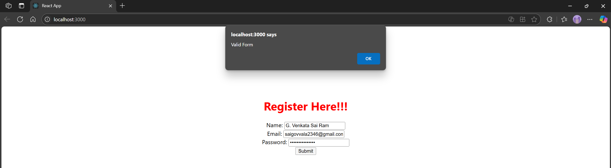
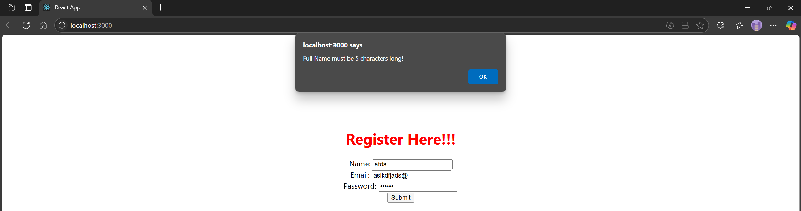
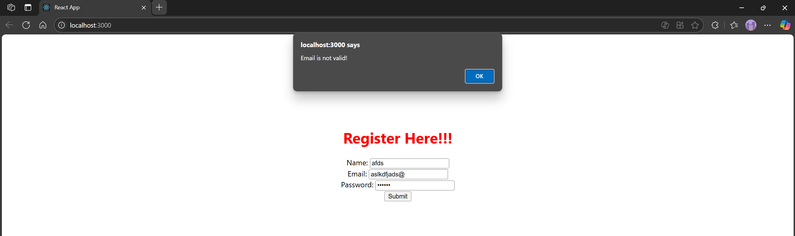
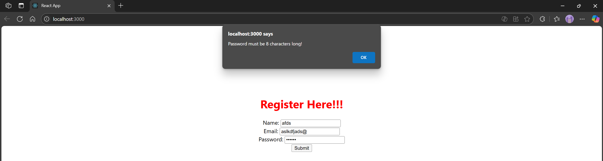

# Hands-on: 16. ReactJS HOL

## Scenario
Create a React App named “mailregisterapp” which will have a component named “register.js”. Create a form which accepts the name, email and password and validate the fields as per the following:

1.	Name should have atleast 5 characters
2.	Email should have @ and .
3.	Password should have atleast 8 characters.

Ensure that validations are implemented through eventhandle and eventsubmit of a form.

## Steps
### 1️⃣ Initial Setup
* Create a React project named “mailregisterapp” by typing the following command in the terminal of Visual Studio:
```bash
npx create-react-app mailregisterapp
```

### 2️⃣ Creating Register Component
* Create a new file named `register.js` inside the `src/Components` directory.
* Press this to go to the file
    * [`register.js`](./Code/mailregisterapp/src/Components/register.js)

### 3️⃣ Editing App.js
* Open the [`src/App.js`](./Code/mailregisterapp/src/App.js) file and replace its content.
* Press this to go to the file
    * [`App.js`](./Code/mailregisterapp/src/App.js)

### 4️⃣ Running the Application
* Open the terminal in Visual Studio Code and navigate to the project directory.
* Run the following command to start the application:
```bash
npm start
```

## Output
#### valid form


#### Name validation error


#### Email validation error


#### Password validation error


#### Explain React Forms validation
React Forms validation in a React application involves checking user input against specific criteria before allowing form submission. This is typically done using controlled components, where the form's input values are managed by the component's state. Validation can be implemented through event handlers like `onChange` for real-time feedback or `onSubmit` to check all fields before submission.

The validation logic can include checks for required fields, specific formats (like email), and length constraints (like password length). If the input does not meet the criteria, error messages can be displayed to guide the user in correcting their input. This approach enhances user experience by providing immediate feedback and ensuring that the data submitted is valid and meets the application's requirements.

#### Identify the differences between React Form and HTML Form
React Forms and HTML Forms differ in several key aspects:
1. **State Management**: In React, form inputs are typically controlled components, meaning their values are managed by the component's state. In contrast, HTML Forms rely on the DOM to manage input values directly.
2. **Event Handling**: React uses synthetic events and provides a more consistent event handling system across different browsers. HTML Forms use standard DOM events, which can vary in behavior across browsers.
3. **Data Binding**: React Forms use one-way data binding, where the state drives the input values. HTML Forms use two-way data binding, allowing direct manipulation of input values through the DOM.
4. **Reactivity**: React Forms automatically re-render when the state changes, reflecting updates in the UI. HTML Forms require manual updates to the DOM to reflect changes.
5. **Validation**: React Forms often implement custom validation logic through state and event handlers, while HTML Forms can use built-in validation attributes like `required`, `pattern`, and `minlength`.

#### Explain about controlled components
Controlled components in React are form elements whose values are controlled by the component's state. In a controlled component, the form data is handled by the React component rather than the DOM. This means that the value of the input field is set by the state of the component, and any changes to the input field trigger an update to that state.
This approach allows for better control over the form data, enabling features like validation, conditional rendering, and real-time updates. Controlled components typically use the `value` attribute to set the input's value and an `onChange` event handler to update the state when the user types or interacts with the input field. This ensures that the component's state is always in sync with the user input, making it easier to manage and manipulate form data within a React application.   

#### Identify various React Form input controls
In React, various input controls are used to capture user input in forms. These controls include:
- **Text Input**: A single-line input field for text.
- **Textarea**: A multi-line input field for text.
- **Select**: A dropdown menu for selecting one or more options.
- **Checkbox**: A toggle input for boolean values.
- **Radio Button**: A set of options where only one can be selected.
- **File Input**: Allows users to upload files.
- **Number Input**: A field for numeric input, often with up/down controls.
These input controls can be managed as controlled components, where their values are tied to the component's state, allowing for real-time updates and validation. React provides built-in support for handling these input types, making it easy to create interactive forms that respond to user actions and maintain a consistent state throughout the application.

#### Explain how to handle React Forms
Handling React Forms involves several key steps:
1. **Setting Up State**: Use the `useState` hook to create state variables for each form field. This allows you to track the current value of each input.
2. **Creating Input Elements**: Render input elements (e.g., `<input>`, `<textarea>`, `<select>`) and bind their `value` attributes to the corresponding state variables.
3. **Implementing Change Handlers**: Create `onChange` event handlers for each input element. These handlers should update the corresponding state variable when the user types or makes a selection.
4. **Form Submission**: Handle form submission by creating a function that processes the form data (e.g., sending it to an API). This function can be triggered by a button click or form submission event.
5. **Validation**: Implement validation logic to ensure that the form data meets the required criteria before submission. This can involve checking for empty fields, validating email formats, etc.
6. **Preventing Default Behavior**: In the form submission handler, use `event.preventDefault()` to prevent the default form submission behavior, allowing you to handle the data as needed without reloading the page.

#### Explain about submitting forms in React
Submitting forms in React involves capturing the form data and processing it when the user submits the form. This can be done by creating a submit handler function that is triggered when the form is submitted. The submit handler can access the current state of the form fields and perform actions such as sending the data to an API or updating the application state.

To submit a form in React:
1. **Create a Submit Handler**: Define a function that will handle the form submission. This function should accept the form data as an argument.
2. **Attach the Submit Handler**: Bind the submit handler to the form's `onSubmit` event. This can be done by passing the handler function to the `onSubmit` prop of the form element.
3. **Prevent Default Behavior**: Inside the submit handler, use `event.preventDefault()` to prevent the default form submission behavior.
4. **Process the Form Data**: Access the form data from the component's state and perform the desired actions (e.g., sending it to an API).