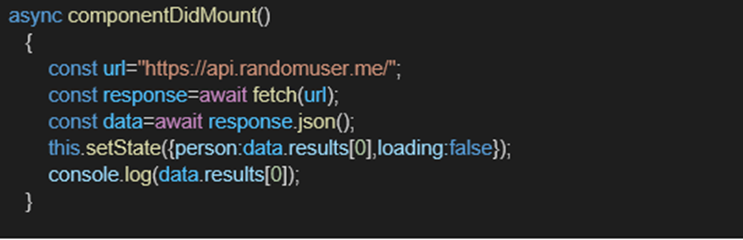
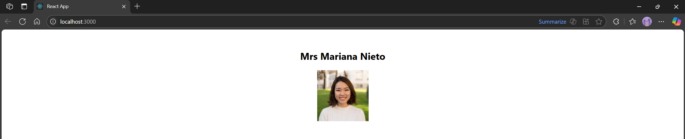
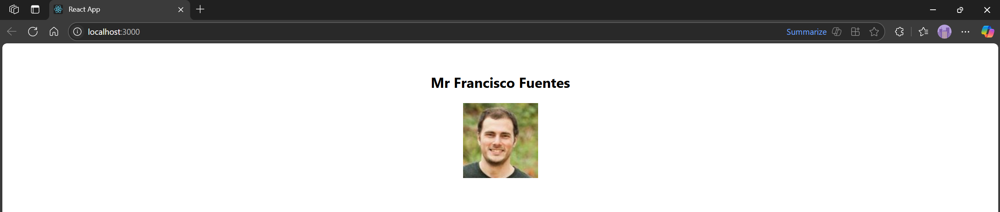

# Hands-on: 17. ReactJS HOL

## Scenario
Create a React Application “fetchuserapp” which will retrieve the user details from https://api.randomuser.me/ and display the title, firstname and image of a user.
Create a component named “Getuser” and in the asynchronous method “ComponentDidMount ()”  invoke the URL using fetch method and the response can be displayed in the render method of the component. 
Code Snippet in Getuser Component:
 


## Steps
### 1️⃣ Initial Setup
* Create a React project named “fetchuserapp” by typing the following command in the terminal of Visual Studio:
```bash
npx create-react-app fetchuserapp
```

### 2️⃣ Creating Getuser Component
* Create a new file named `Getuser.js` inside the `src/Components` directory.
* Press this to go to the file
    * [`Getuser.js`](./Code/fetchuserapp/src/Components/Getuser.js)

### 3️⃣ Editing App.js
* Open the [`src/App.js`](./Code/fetchuserapp/src/App.js) file and replace its content.
* Press this to go to the file
    * [`App.js`](./Code/fetchuserapp/src/App.js)    

### 4️⃣ Running the Application
* Open the terminal in Visual Studio Code and navigate to the project directory.
* Run the following command to start the application:
```bash
npm start
```

## Output
#### User Details Output 1


#### User Details Output 2


#### Explain how to consume REST APIs from React applications
Consuming REST APIs in React applications typically involves using the `fetch` API or libraries like `axios` to make HTTP requests. The process generally follows these steps:
1. **Make a Request**: Use `fetch` or `axios` to send a request to the API endpoint. This can be done in lifecycle methods like `componentDidMount` for class components or using the `useEffect` hook in functional components.
2. **Handle the Response**: Once the request is complete, handle the response by converting it to JSON format using `.json()` method for `fetch` or directly accessing the data with `axios`.
3. **Update State**: Store the retrieved data in the component's state using `set State` for class components or the `useState` hook for functional components.
4. **Render the Data**: Use the state to render the data in the component's JSX. This allows the UI to reflect the data fetched from the API.