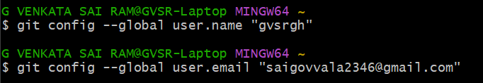
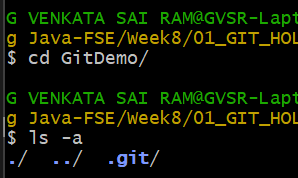

# Hands-on: 1. Git HOL

Check GitDemo repository here - [GitDemo](https://github.com/gvsrgh/GitDemo)

## Output
#### Checking git version

#### Configuring git

#### Checking git config

#### Adding Notepad++ to git

#### Notedpad++ Aliasing

#### Notepad++ Aliasing in git

#### Initializing a git repository

#### Verifying git repository

#### Creating welcome.txt file

#### Checking git status

#### Committing changes

#### Git status after commit

#### Pushing changes to remote repository
