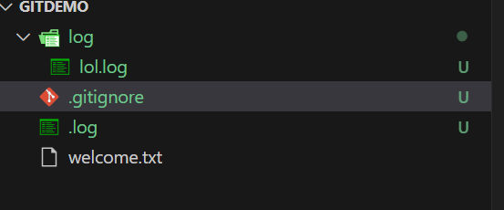
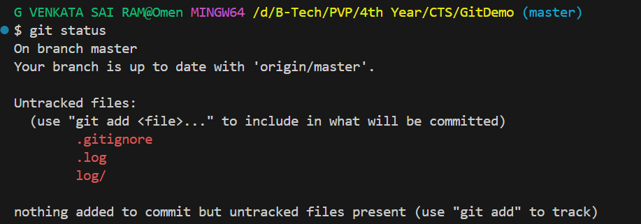
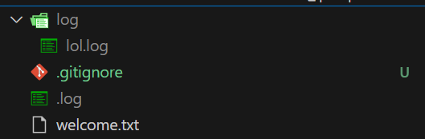
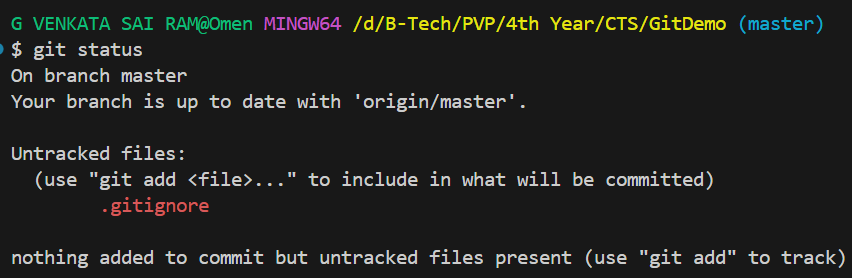
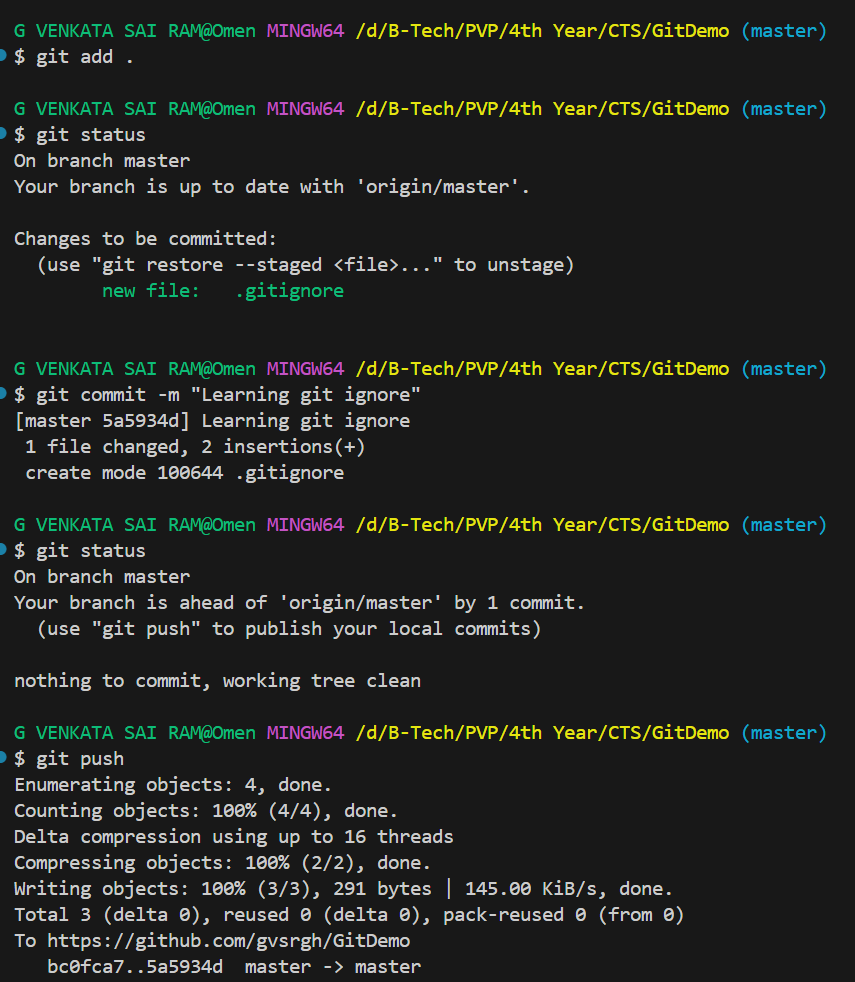

# Hands-on: 2. Git HOL

## Scenario
Create a “.log” file and a log folder in the working directory of Git. Update the .gitignore file in such a way that on committing, these files (.log extensions and log folders) are ignored.
Verify if the git status reflects the same about working directory, local repository and git repository. 

## Output
#### File Structure



#### Git Status (Before Git Ignore)


#### File Structure After Git Ignore


#### Git Status (After Git Ignore)


#### Pushing Changes to Remote Repository


#### Git Repository After Pushing


#### Explain git ignore
Git ignore is a file used in Git repositories to specify intentionally untracked files that Git should ignore. This is useful for excluding files that are not necessary for version control, such as temporary files, build artifacts, or sensitive information. By listing these files in a `.gitignore` file, you can prevent them from being added to the repository and cluttering the commit history.

#### Explain how to ignore unwanted files using git ignore
To ignore unwanted files using a `.gitignore` file, follow these steps:

1. Create a file named `.gitignore` in the root directory of your Git repository if it doesn't already exist.
2. Open the `.gitignore` file in a text editor.
3. Add the file patterns or specific file names you want to ignore, one per line. For example:
   ```
   # Ignore temporary files
   *.tmp
   temp/
   ```
4. Save the `.gitignore` file.
5. If you have already tracked files that you now want to ignore, you need to untrack them using the following command:
   ```
   git rm --cached <file>
   ```
   Replace `<file>` with the name of the file you want to untrack.
6. Commit your changes to apply the updated `.gitignore` rules.
7. From now on, Git will ignore the files specified in the `.gitignore` file, and they will not appear in the list of untracked files or be included in future commits.
8. You can verify that the files are being ignored by running:
    ```
    git status
    ```
    The ignored files should not appear in the output.