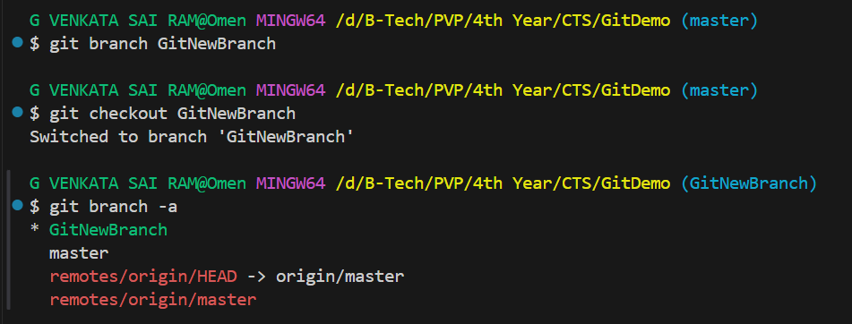
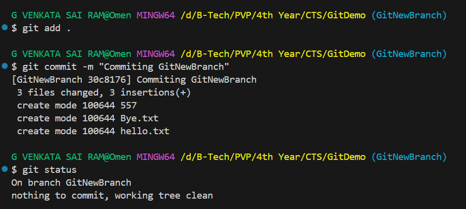
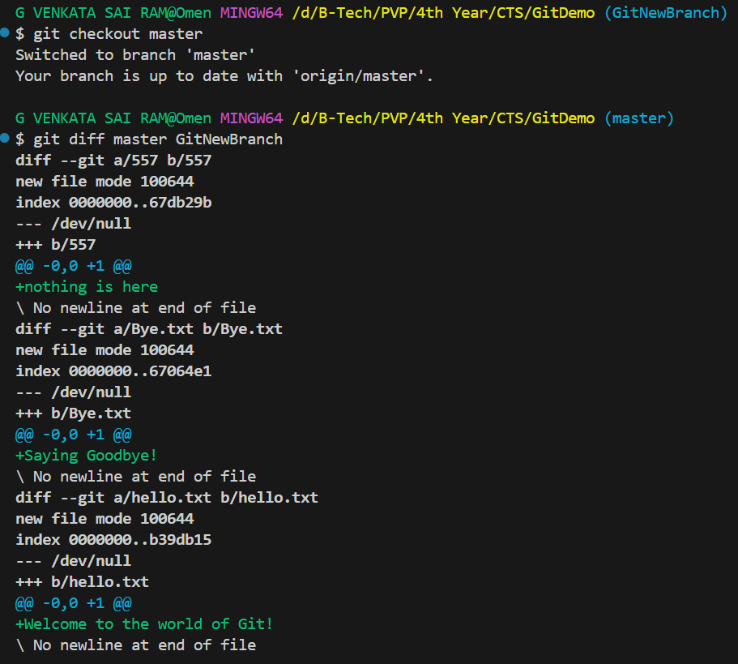
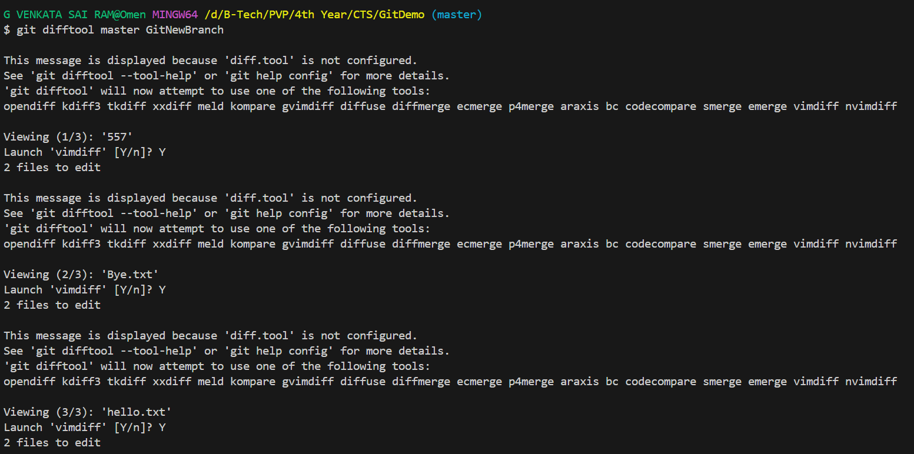
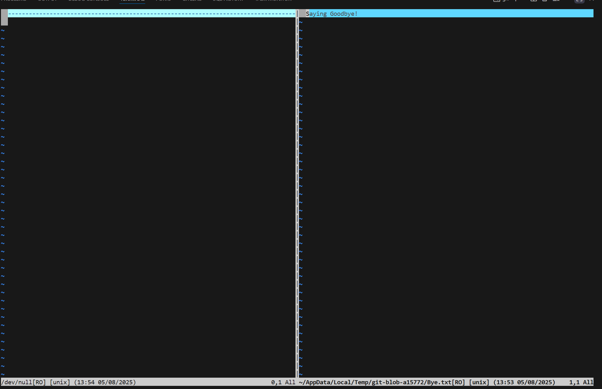
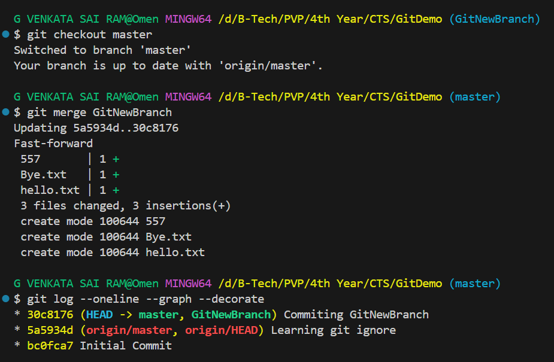
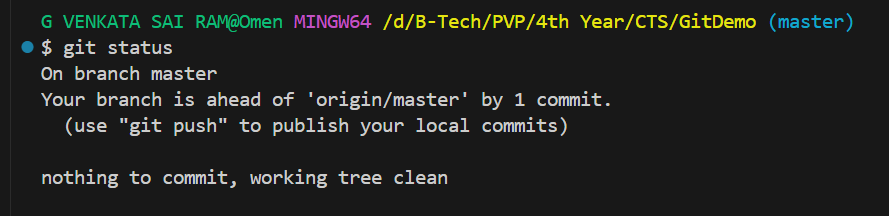

# Hands-on: 3. Git HOL

Check GitDemo repository here - [GitDemo](https://github.com/gvsrgh/GitDemo)

## Scenario
Please follow the instruction to complete the hands-on. Each instruction expects a command for the Git Bash.

Branching: 
1.	Create a new branch “GitNewBranch”. 
2.	List all the local and remote branches available in the current trunk. Observe the “*” mark which denote the current pointing branch. 
3.	Switch to the newly created branch. Add some files to it with some contents.
4.	Commit the changes to the branch.
5.	Check the status with “git status” command.

Merging: 
1.	Switch to the master
2.	List out all the differences between trunk and branch. These provide the differences in command line interface.
3.	List out all the visual differences between master and branch using P4Merge tool.
4.	Merge the source branch to the trunk.
5.	Observe the logging after merging using “git log –oneline –graph –decorate”
6.	Delete the branch after merging with the trunk and observe the git status.

## Output
#### Creating new branch

#### Committing changes to the branch

#### Listing differences between trunk and branch

#### Difftool

#### Differences

#### Merging branch to trunk

#### Git Status after merging

#### Explain branching and merging
Branching in Git allows you to create a separate line of development, enabling you to work on features or fixes independently from the main codebase. Merging is the process of integrating changes from one branch into another, typically from a feature branch back into the main branch (often called `main` or `master`).

#### Explain about creating a branch request in GitLab
In GitLab, a branch request (often referred to as a merge request) is created to propose changes from one branch to another. This is done by:
1. Navigating to the repository in GitLab.
2. Switching to the "Merge Requests" tab.
3. Clicking on the "New Merge Request" button.
4. Selecting the source branch (the branch with your changes) and the target branch (the branch you want to merge into).
5. Adding a title and description for your merge request.
6. Submitting the merge request for review.

#### Explain about creating a merge request in GitLab
A merge request in GitLab is a request to merge changes from one branch into another. It allows team members to review code changes, discuss them, and approve or reject the changes before they are merged. The process typically involves:
1. Creating a branch for your changes.
2. Making the necessary code changes in your branch.
3. Committing the changes and pushing the branch to the remote repository.
4. Navigating to the "Merge Requests" tab in GitLab.
5. Clicking on the "New Merge Request" button.
6. Selecting the source branch (the branch with your changes) and the target branch (the branch you want to merge into).
7. Adding a title and description for your merge request.
8. Submitting the merge request for review.