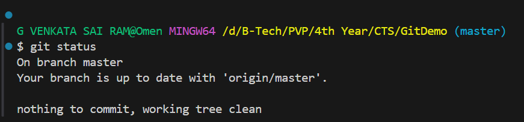
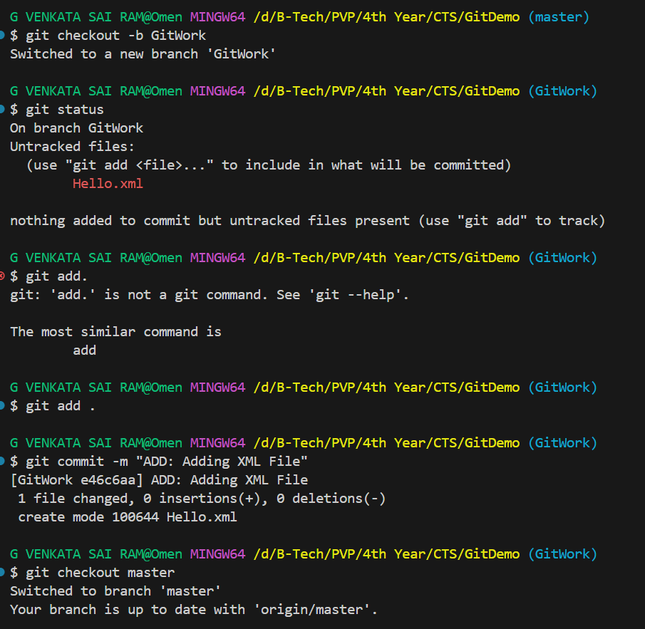
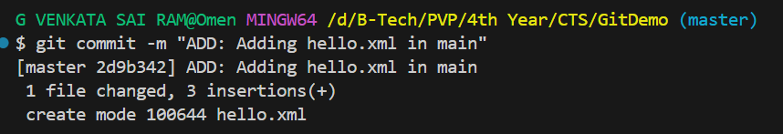
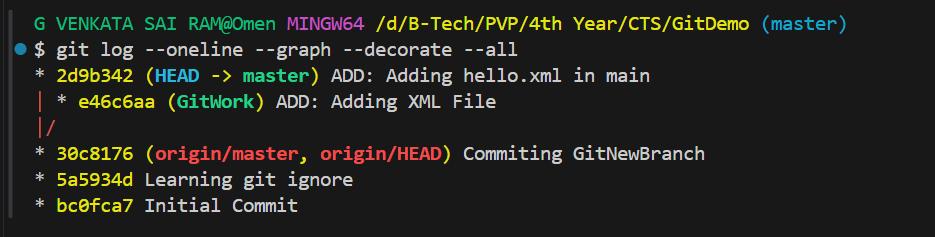
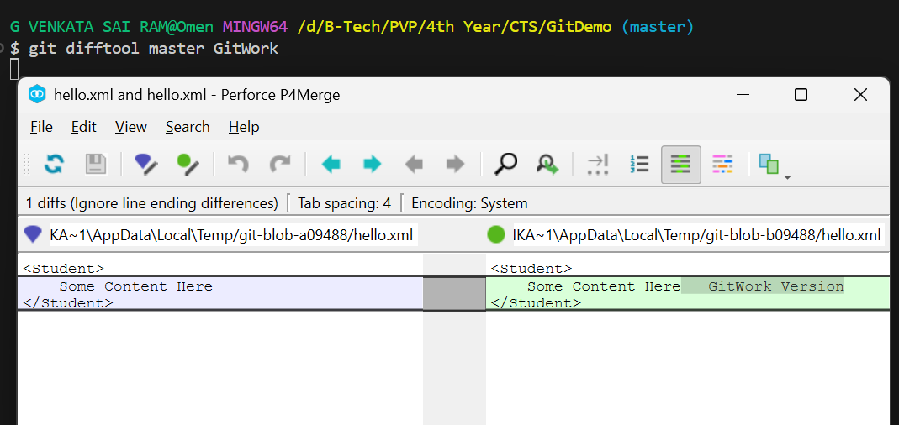
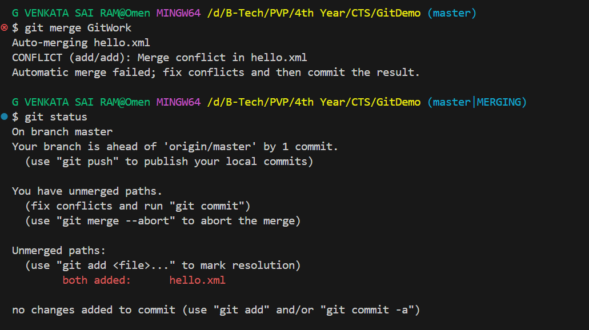
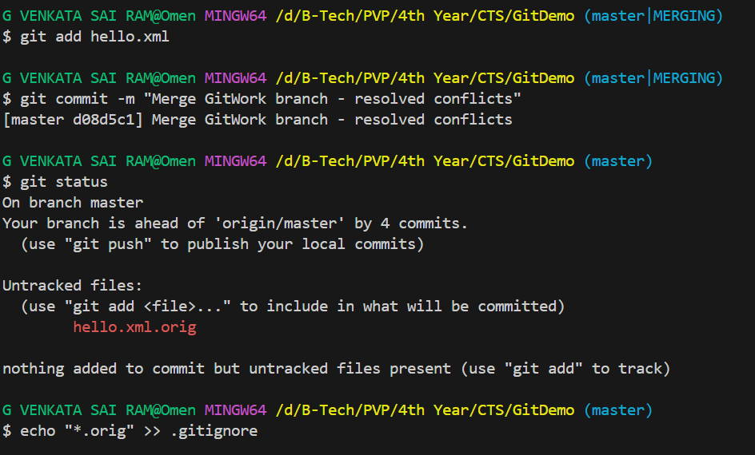
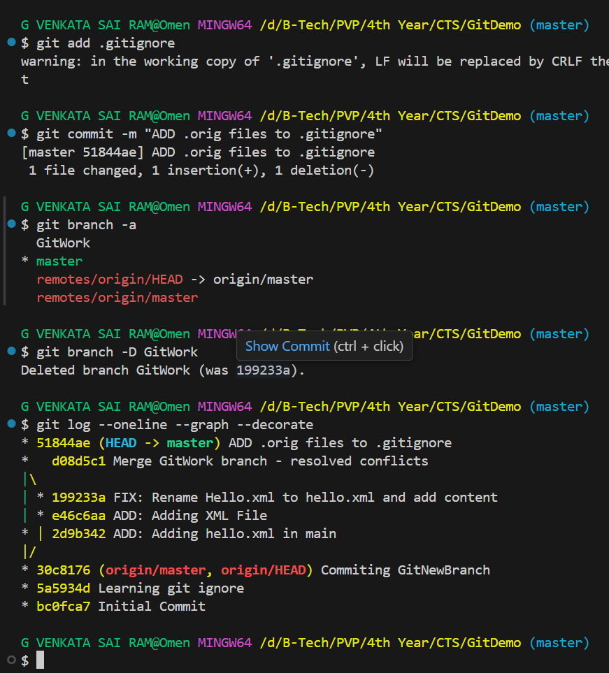

# Hands-on: 4. Git HOL

Check GitDemo repository here - [GitDemo](https://github.com/gvsrgh/GitDemo)

## Scenario
Please follow the instructions to complete the hands-on. Each instruction expect a command for the Git Bash.
1.	Verify if master is in clean state.
2.	Create a branch “GitWork”. Add a file “hello.xml”.
3.	Update the content of “hello.xml” and observe the status
4.	Commit the changes to reflect in the branch
5.	Switch to master.
6.	Add a file “hello.xml” to the master and add some different content than previous.
7.	Commit the changes to the master
8.	Observe the log by executing “git log –oneline –graph –decorate –all”
9.	Check the differences with Git diff tool
10.	For better visualization, use P4Merge tool to list out all the differences between master and branch
11.	Merge the bran to the master
12.	Observe the git mark up.
13.	Use 3-way merge tool to resolve the conflict
14.	Commit the changes to the master, once done with conflict 
15.	Observe the git status and add backup file to the .gitignore file.
16.	Commit the changes to the .gitignore
17.	List out all the available branches
18.	Delete the branch, which merge to master.
19.	Observe the log by executing “git log –oneline –graph –decorate”

## Output
#### Checking if master is in clean state

#### Creating a branch "GitWork" and adding a file "hello.xml"

#### Adding Hello.xml in main

#### Git Status after adding hello.xml

#### Difftool output

#### Merge conflict output

#### Git Mergetool output

#### Commiting changes after resolving conflict

#### Final Commit

#### Explain how to resolve the conflict during merge
To resolve a conflict during a merge in Git, follow these steps:
1. Identify the files with conflicts by checking the output of `git status`.
2. Open the conflicted files in a text editor. Git will mark the conflicting sections with `<<<<<<<`, `=======`, and `>>>>>>>`.
3. Manually edit the file to resolve the conflicts by choosing which changes to keep or combining them as necessary.
4. After resolving the conflicts, save the file.
5. Use `git add <filename>` to stage the resolved files.
6. Finally, commit the changes with `git commit`, which will finalize the merge. 