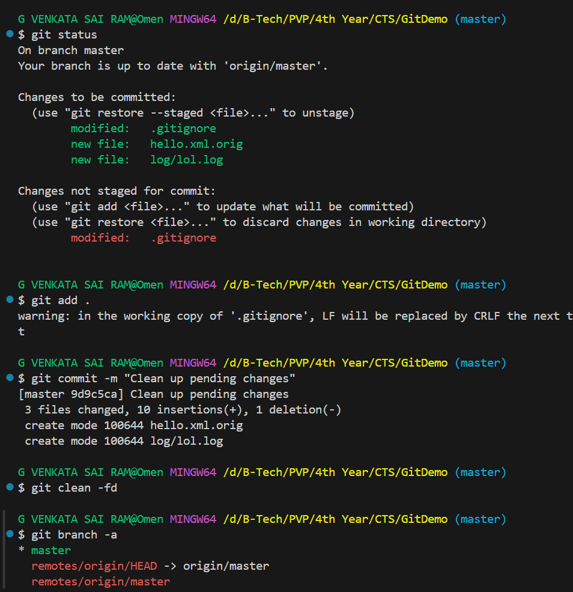
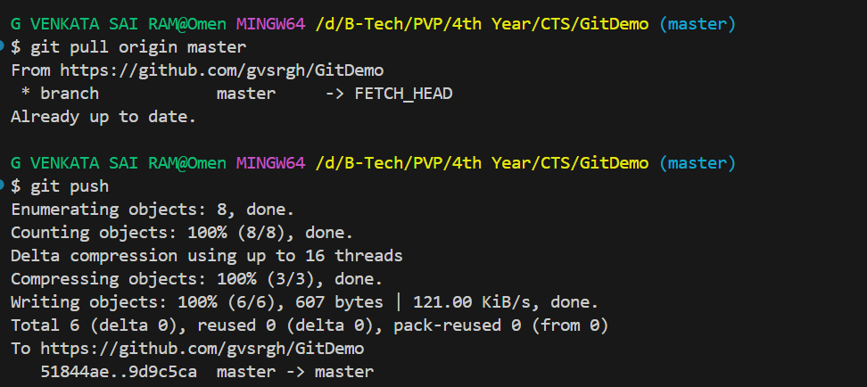
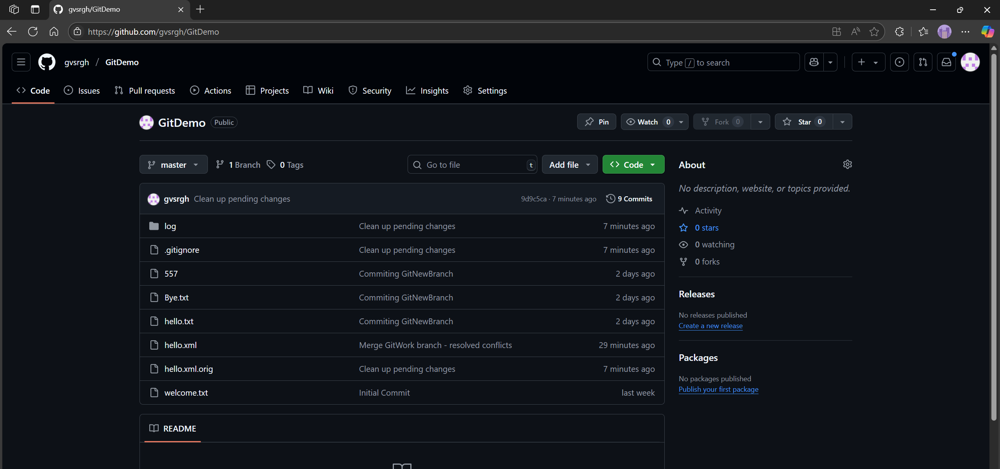

# Hands-on: 4. Git HOL

Check GitDemo repository here - [GitDemo](https://github.com/gvsrgh/GitDemo)

## Scenario
Please follow the instructions to complete the hands-on. Each instruction expects a command for the Git Bash.
1.	Verify if master is in clean state.
2.	List out all the available branches.
3.	Pull the remote git repository to the master
4.	Push the changes, which are pending from “Git-T03-HOL_002” to the remote repository. 
5.	Observe if the changes are reflected in the remote repository.

## Output
#### Checking Git Status

#### Pushing changes to remote repository

#### Remote repository changes

#### Explain how to clean up and push back to remote Git
To clean up and push back to the remote Git repository, follow these steps:
1. Ensure you are on the correct branch by executing `git checkout <branch-name>`. 
2. Check the status of your branch with `git status` to see if there are any uncommitted changes.
3. If there are uncommitted changes, either commit them using `git add .` followed by `git commit -m "Your commit message"` or discard them using `git reset --hard`.
4. Once your branch is clean, push the changes to the remote repository using `git push origin <branch-name>`.